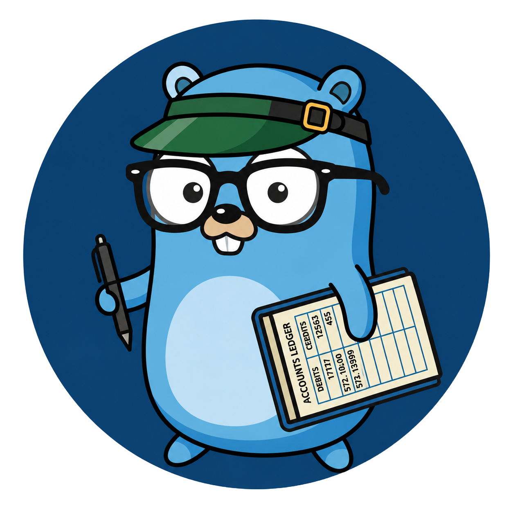
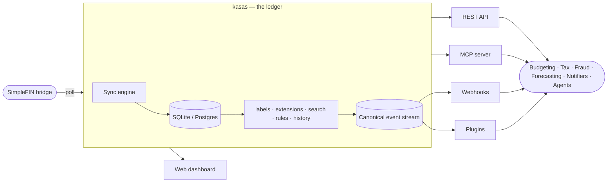

<p align="center">
  
</p>

<h1 align="center">kasas</h1>

<p align="center">
  <strong>A financial ledger that can power all kinds of apps.</strong>
</p>

<p align="center">
  <a href="https://github.com/paulmeier/kasas/actions/workflows/ci.yml"></a>
  <a href="https://github.com/paulmeier/kasas/actions/workflows/release-please.yml"></a>
  <a href="https://github.com/paulmeier/kasas/pkgs/container/kasas"></a>
  <a href="https://paulmeier.github.io/kasas/"></a>
  <a href="LICENSE"></a>
</p>

---

kasas is a self-hosted, single-binary Go service that syncs your
[SimpleFIN](https://www.simplefin.org/) financial data into a local **SQLite** (or
**Postgres**) database and turns it into a programmable substrate: a **REST API**, a
built-in **[MCP](https://modelcontextprotocol.io/) server**, a canonical **event
stream**, outbound **webhooks**, and sandboxed **plugins**.

It is deliberately **not** another Mint, budgeting app, or financial planner. It's
the **ledger those apps are built on.** kasas owns the boring, load-bearing parts —
connecting to your bank, deduping and refreshing transactions, a durable history of
every change, an extensible metadata model — so anything you build on top
(budgeting, tax, fraud detection, forecasting, notifications, AI agents) starts
from clean, queryable, event-driven data.



## Why kasas

- **Backbone, not app.** Unopinionated about the application layer, so the
  application layer can be anything — yours and everyone else's.
- **The data you add is sacred.** A sync refreshes what the bank owns and **never**
  touches your labels or extensions. Every change is a fact, recorded as a durable
  event and an immutable history snapshot in the *same* transaction as the change.
- **Build through real seams.** An [event stream](https://paulmeier.github.io/kasas/features/event-stream/),
  [webhooks](https://paulmeier.github.io/kasas/features/webhooks/),
  [plugins](https://paulmeier.github.io/kasas/features/plugins/), and
  [MCP](https://paulmeier.github.io/kasas/interfaces/mcp/) — extend it without forking it.
- **Boring to run.** One static binary, no CGO, an embedded database **and** an
  embedded dashboard, Prometheus metrics, structured logs, graceful shutdown.

## Features

| | |
| --- | --- |
| 🔄 **[Automatic sync](https://paulmeier.github.io/kasas/features/sync/)** | Scheduled SimpleFIN polling; inserts new transactions, refreshes bridge fields, preserves your labels. |
| 🗄️ **[SQLite or Postgres](https://paulmeier.github.io/kasas/architecture/data-model/)** | Zero-dependency embedded SQLite by default, or Postgres with one config change. Same binary, no CGO. |
| 🏷️ **[Labels & extensions](https://paulmeier.github.io/kasas/features/labels/)** | Strict `key:value` labels, plus arbitrary namespaced JSON extensions any app can attach — no schema change. |
| 🔎 **[Search](https://paulmeier.github.io/kasas/features/search/)** | One query language over every field and label/extension combo, with `AND`/`OR`/`NOT`, ranges, and grouping. |
| ⚙️ **[Rules](https://paulmeier.github.io/kasas/features/rules/)** | `if <query> then apply <labels>` — auto-applied to new transactions, runnable over history. |
| 📜 **[Events & history](https://paulmeier.github.io/kasas/features/event-stream/)** | An append-only, replayable change log, an immutable full-snapshot history per transaction, and a derived [provenance](https://paulmeier.github.io/kasas/features/transaction-provenance/) view of each one's origin and lineage. |
| 🪝 **[Webhooks & plugins](https://paulmeier.github.io/kasas/features/webhooks/)** | Push HMAC-signed events to your services, or run sandboxed Lua plugins in-process. |
| 🤖 **[REST + MCP + dashboard](https://paulmeier.github.io/kasas/interfaces/rest-api/)** | Three surfaces over one core: code, an AI agent, or the built-in WebAssembly UI. |
| 🔐 **[Auth & API keys](https://paulmeier.github.io/kasas/interfaces/authentication/)** | A dashboard token plus scoped, hash-stored API keys across read / write / admin tiers. |
| 📈 **[Metrics & self-update](https://paulmeier.github.io/kasas/interfaces/metrics/)** | Prometheus at `/metrics`, plus checksum-verified in-place self-update. |

## Quick start

Prebuilt multi-arch images are published to GHCR on every release.

```sh
export KASAS_SIMPLEFIN_SETUP_TOKEN="<your base64 setup token>"
docker compose up -d --build      # or swap in image: ghcr.io/paulmeier/kasas:latest
```

```sh
curl localhost:8080/api/v1/sync       # latest sync status
curl localhost:8080/api/v1/accounts   # synced accounts
```

Then open the dashboard at **http://localhost:8080**.

> **Volume permissions:** the container runs as UID `65532` — the mounted data dir
> must be writable by it: `mkdir -p data && sudo chown -R 65532:65532 data`.
>
> By default kasas is **unauthenticated**. Set a dashboard token and keep it on a
> trusted network — see [Authentication](https://paulmeier.github.io/kasas/interfaces/authentication/).

Full walkthrough: **[Quick Start →](https://paulmeier.github.io/kasas/getting-started/quick-start/)**

## Documentation

The complete documentation — architecture, internals, sequence diagrams, and a
reference for every feature and surface — lives at
**[paulmeier.github.io/kasas](https://paulmeier.github.io/kasas/)**.

- [**Philosophy**](https://paulmeier.github.io/kasas/architecture/philosophy/) — the platform thesis
- [**System Overview**](https://paulmeier.github.io/kasas/architecture/overview/) — how it all fits together
- [**Configuration**](https://paulmeier.github.io/kasas/getting-started/configuration/) · [**Deployment**](https://paulmeier.github.io/kasas/getting-started/deployment/)
- [**REST API**](https://paulmeier.github.io/kasas/interfaces/rest-api/) · [**MCP**](https://paulmeier.github.io/kasas/interfaces/mcp/) · [**Event Stream**](https://paulmeier.github.io/kasas/features/event-stream/)

## Contributing

See **[CONTRIBUTING.md](CONTRIBUTING.md)** for local development, testing (including
the gated Postgres integration test), regenerating sqlc code, and the
Conventional-Commits / release-please flow. CI — gofmt, lint, race tests against
SQLite *and* Postgres, and a build stage — must pass on every PR.

## License

[MIT](LICENSE)
