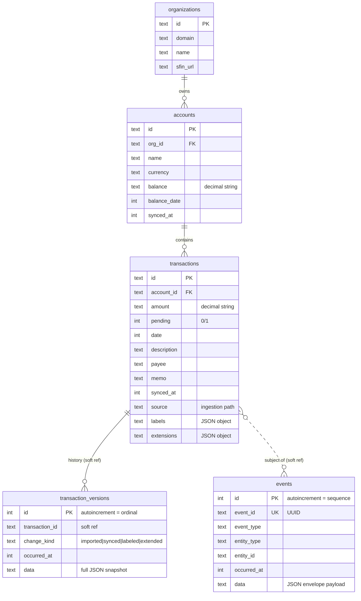

# Data Model

kasas keeps a deliberately small, stable schema. Most of it is **derived from the
bank** (organizations, accounts, transactions) and refreshed on every sync; a few
tables hold **state you create** (rules, webhooks, plugins, API keys); and a few
are an **append-only record** of what happened (events, transaction versions,
sync log).

## Entity relationships

The hard foreign keys are `accounts.org_id → organizations.id` and
`transactions.account_id → accounts.id`, both `ON DELETE CASCADE`. The
**append-only** tables (`events`, `transaction_versions`) reference a transaction
by id but are *not* enforced foreign keys — they are an independent record that
must survive even if the subject is later removed, and an event's `entity_id` can
point at any kind of entity (a transaction, an account, a rule, a sync).

## All tables

| Table | Kind | Purpose |
| --- | --- | --- |
| `organizations` | Derived | Financial institutions seen via SimpleFIN. |
| `accounts` | Derived | Your accounts: balance, currency, last-synced time. |
| `transactions` | Derived + yours | The ledger. Bridge fields are refreshed each sync; `labels`, `extensions`, and `source` ([provenance](../features/transaction-provenance.md)) are never overwritten. |
| `sync_log` | Record | One row per [sync run](../features/sync.md): start, finish, status, error. |
| `rules` | Yours | [Auto-labeling rules](../features/rules.md): a query + labels to apply. |
| `events` | Record | The append-only [event stream](../features/event-stream.md). |
| `transaction_versions` | Record | Immutable [history](../features/transaction-history.md): a full snapshot per change. |
| `api_keys` | Yours | Scoped [API keys](../interfaces/authentication.md#api-keys); only a SHA-256 hash is stored. |
| `webhooks` | Yours | Registered [webhook](../features/webhooks.md) endpoints + delivery health. |
| `plugins` | Yours | Discovered [plugins](../features/plugins.md): granted capabilities, config, run health. |

!!! info "Storage conventions"
    - **Money is text.** `amount` and `balance` are exact decimal strings exactly
      as SimpleFIN returns them — never parsed to a float. Comparisons in
      [search](../features/search.md) parse on demand but storage stays exact.
    - **Time is unix seconds.** All `*_at` and `date` columns are `INTEGER` unix
      timestamps; the API renders them as RFC 3339 UTC.
    - **Booleans are integers.** `pending`, `enabled` are `0`/`1`.
    - **`labels` and `extensions` are JSON columns** on `transactions` — a
      `key:value` string map and an arbitrary namespaced JSON map respectively
      (see [Labels](../features/labels.md) vs [Extensions](../features/schema-extensions.md)).
    - **`source` records ingestion provenance** — which path produced the row,
      stamped at insert and never overwritten. Everything else a transaction's
      [provenance](../features/transaction-provenance.md) reports is *derived* on
      read from the row, its organization, and its `transaction_versions`; `source`
      is the one fact that can't be, so it's the one stored field.
    - **SQLite tables are `STRICT`**, so adding a `NOT NULL` column requires a
      constant default — which is why `labels`/`extensions` defaulted in via
      `ALTER TABLE`.

## Multi-dialect storage

The same binary runs on **SQLite or Postgres**, chosen at runtime by
`database.driver`. The rest of the app never knows which — it talks to a single
`db.Store` interface.

```mermaid
flowchart TB
    APP[poller · api · events · plugins] --> STORE

    subgraph STORE["db.Store interface"]
        direction LR
        Q["Querier<br/>(~50 generated methods)"]
        TX["RunInTx&#40;fn&#41;"]
        PING["Ping / Close"]
    end

    STORE --> SQ[SQLiteStore]
    STORE --> PG[PostgresStore]

    SQ -->|embeds| GENS["*db.Queries<br/>(sqlc → internal/db)"]
    PG -->|adapts| GENP["*pg.Queries<br/>(sqlc → internal/db/pg)"]

    GENS --> LITE[(SQLite<br/>modernc.org/sqlite · WAL)]
    GENP --> POST[(Postgres<br/>jackc/pgx)]

    QSRC["queries/*.sql<br/>+ queries/sqlite, queries/postgres"] -.->|sqlc generate| GENS
    QSRC -.->|sqlc generate| GENP
```

The pieces:

- **`db.Store`** ([`internal/db/store.go`](https://github.com/paulmeier/kasas/blob/main/internal/db/store.go))
  is `Querier` + `RunInTx` + `Ping` + `Close`. `RunInTx(ctx, fn)` runs `fn`
  against a transaction-scoped `Querier`, so the [emitter](../features/event-stream.md)
  can write a change and its events atomically.
- **`SQLiteStore`** embeds the sqlc-generated `*Queries` directly — for SQLite the
  canonical types *are* the generated types.
- **`PostgresStore`** wraps `*pg.Queries` (generated into `internal/db/pg`) in a
  thin `pgQuerier` adapter. Because the two sqlc outputs are generated to be
  byte-identical in shape, the adapter is mostly whole-struct casts, with a
  little int32↔int64 massaging where Postgres infers narrower integers.
- **Queries** live in [`queries/`](https://github.com/paulmeier/kasas/tree/main/queries):
  one shared set for both dialects, plus per-dialect `queries/sqlite` and
  `queries/postgres` directories for the one thing that genuinely differs —
  **server-side JSON label filtering**, which uses `json_extract` with a quoted
  path on SQLite and `jsonb` operators on Postgres. [sqlc](https://sqlc.dev)
  generates the type-safe Go for both.

!!! tip "Switching backends"
    Point kasas at Postgres with `database.driver=postgres` and a `database.dsn`;
    it creates its schema on first start via the same embedded migrations. Data is
    **not** migrated between backends — each keeps its own database. See
    [Deployment → Postgres](../getting-started/deployment.md#postgres).

## Migrations

Schema is managed by embedded [goose](https://github.com/pressly/goose) migrations
under [`migrations/`](https://github.com/paulmeier/kasas/tree/main/migrations),
with a dialect-specific set in `migrations/sqlite` and `migrations/postgres`. They
are applied automatically on startup (and runnable explicitly with
[`kasas migrate`](../reference/cli.md#migrate)). The migration history doubles as a
changelog of the data model — tags became strict `labels`, then `rules`, `events`,
`transaction_versions`, `api_keys`, `webhooks`, `extensions`, and `plugins` were
each added in turn.
