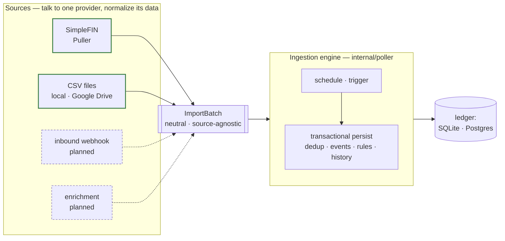

# Ingestion & Sources

kasas is a **source-agnostic ledger**. Data arrives through a *source* — a small
adapter that knows how to talk to one provider and shape its data into a neutral
batch — and a generic *ingestion engine* persists it. [SimpleFIN](https://www.simplefin.org/)
is the **first** source, and today the only built-in one, but it is not special:
it plugs into the engine through the same contract any future source will.

Source: [`internal/source`](https://github.com/paulmeier/kasas/tree/main/internal/source)
(the SDK) · [`internal/sources/simplefin`](https://github.com/paulmeier/kasas/tree/main/internal/sources/simplefin)
(the reference source) · [`internal/poller`](https://github.com/paulmeier/kasas/tree/main/internal/poller)
(the engine).

## Source vs. engine

The design draws one hard line: a **source produces data; the engine writes it.**



A source returns an [`ImportBatch`](#the-importbatch) and **never touches the
database**. Everything load-bearing — scheduling, the single-transaction persist,
idempotent dedup, [events](../features/event-stream.md), [rule](../features/rules.md)
auto-labeling, and [history](../features/transaction-history.md) — lives in the
engine, written once and shared by every source. The payoff:

- **A buggy source is contained.** The worst it can do is return a batch the
  engine rejects; it cannot corrupt the ledger, skip dedup, or drop an event.
- **Every source inherits the platform.** Provenance stamping, the
  "[data you add is sacred](philosophy.md#design-principles)" guarantee, atomic
  events-with-changes — a new source gets all of it for free.
- **Downstream sees one shape.** REST, MCP, the dashboard, webhooks, and plugins
  consume the same normalized transactions no matter where they came from.

## Archetypes, not providers

There are countless financial-data providers, but only a handful of *ways* data
arrives. kasas models those **archetypes** — how a source delivers data — instead
of modeling each provider. Build the engine once per archetype and every provider
in that archetype is a thin adapter. **O(archetypes), not O(providers).**

| Archetype | How data arrives | Engine trigger | Examples |
| --- | --- | --- | --- |
| **`pull`** | The engine fetches on a schedule. | `gocron` interval + on-demand | SimpleFIN, Teller, on-chain |
| **`file`** | Files in a folder are parsed. | scheduled folder scan | **CSV (local + Google Drive)**, OFX, QIF |
| **`webhook`** | An inbound request pushes data. | HTTP endpoint | Plaid, Stripe |
| **`manual`** | A human or agent writes directly. | API / MCP call | hand-entered cash |
| **`enrichment`** | Annotates transactions that already exist. | post-change hook | categorizers, geocoders |

A source declares its archetype in its [descriptor](#descriptors) and implements
the matching **capability interface**. The engine detects what a source can do by
type assertion, so a source opts into exactly the capabilities it has:

```go
// internal/source/source.go — capabilities are small, composable interfaces.
type Source interface {
    Descriptor() Descriptor // every source describes itself
}

type Puller interface { // archetype "pull"
    Fetch(ctx context.Context, since time.Time, cursor string) (*ImportBatch, error)
}

type Credentialed interface { // optional: a runtime-settable credential
    CredentialConfigured(ctx context.Context) (bool, error)
    SetCredential(ctx context.Context, input string) error
}

type OAuthCredentialed interface { // optional: a browser OAuth 2.0 connect flow
    OAuthConfigured() bool
    AuthCodeURL(state string) string
    ExchangeCode(ctx context.Context, code string) error
}
```

`Puller`, `Credentialed`, and `OAuthCredentialed` exist today, and **two
archetypes ship**: `pull` (SimpleFIN) and `file` (CSV import). The `file` source
reuses the `pull` trigger — scanning its configured folders on the sync schedule —
rather than needing a separate file-upload interface, so adding it required **no
engine change**. The `webhook` and `enrichment` archetypes remain reserved in the
taxonomy; their capability interfaces land here as each is built, and because every
capability is independent, adding one never disturbs existing sources.

## The `ImportBatch`

The whole contract is "give the engine an `ImportBatch`." It is the neutral,
source-agnostic result of a fetch or parse — normalized to kasas's universal core
fields, so every source looks identical downstream.

```go
type ImportBatch struct {
    Source   string          // provenance stamp written on every row
    Accounts []ImportAccount // accounts observed, each with its transactions
    Cursor   string          // opaque resume token the engine persists (optional)
}
```

Each `ImportTxn` carries only the universal fields every financial transaction has
— amount, date, description, payee, memo, pending, and the source's own external
id. Anything provider-specific (gas and token symbol for on-chain, line items for
a receipt, a category a bank guessed) belongs in
[extensions](../features/schema-extensions.md), namespaced JSON the engine keeps
out of the core columns. The source does the provider-specific normalization —
SimpleFIN, for instance, resolves a stable org id and picks the posted-vs-
transacted date — so the engine only ever sees clean, universal data.

!!! info "The `source` stamp & provenance"
    The engine writes the batch's `Source` onto every row's
    [`transactions.source`](data-model.md) column, stamped at insert and **never**
    overwritten on re-sync. It is the one fact about a transaction that can't be
    reconstructed from its contents — nothing in bank-owned data says which path
    imported it — which is exactly why each source declares it. That stamp is what
    powers the per-transaction [provenance](../features/transaction-provenance.md)
    view.

## Self-registration

A source makes itself available by registering in an `init()`, so **importing the
package is all it takes** to wire it in:

```go
// internal/sources/simplefin/simplefin.go
func init() {
    source.Register(descriptor(), func(env source.Env) (source.Source, error) {
        return New(Options{ /* reads access_url / setup_token from env */ }), nil
    })
}
```

The engine then constructs the configured source by type from the registry and
hands it an `Env` (logger, secret store, and its config/credential values). At
startup `cmd/kasas` selects the built-in SimpleFIN source; the wiring is a single
`source.New(type, env)` call, so adding a source is "register it, import its
package, point config at its type" — no engine changes.

## Descriptors

Every source describes itself with a static **descriptor**: its stable type, its
archetype, a human title, and the credential/config fields it needs. This is the
metadata that will render a setup form and list the available sources.

```go
source.Descriptor{
    Type:      "simplefin",
    Archetype: source.ArchetypePull,
    Title:     "SimpleFIN",
    Credentials: []source.CredentialField{
        {Key: "setup_token", Title: "Setup token", Help: "One-time base64 token…"},
        {Key: "access_url",  Title: "Access URL",  Help: "A ready SimpleFIN access URL…"},
    },
}
```

## SimpleFIN: the reference source

SimpleFIN is kept **first-party Go** and serves as the worked example of a
`pull` source. It implements all three interfaces — `Source`, `Puller`, and
`Credentialed` — fetching accounts and transactions from a SimpleFIN bridge and
mapping them into an `ImportBatch`, while the engine owns everything after that.
Its mechanics — credential resolution, the fetch window, insert-vs-refresh
reconciliation — are documented on the [Sync Pipeline](../features/sync.md) page,
which is really the `pull`-archetype engine seen end to end.

## What's wired today

To be precise about the line between *designed* and *shipping*:

- ✅ **The contract and the engine are source-agnostic.** The SDK, the registry,
  the `ImportBatch`, and the generic persist/dedup/events/rules/history pipeline
  are all in place.
- ✅ **SimpleFIN flows through the seam** as a built-in `pull` source and the
  reference `Puller`. Provenance is already stamped per row.
- ✅ **CSV file import** is the second built-in source — a `file` source with
  **local-folder and Google Drive** backends, running alongside SimpleFIN. See
  [CSV File Import](../features/csv-import.md).
- ✅ **Sources are surfaced** across REST (`/api/v1/sources`), MCP (`list_sources`,
  `sync_source`), and the dashboard **Sources** page — each with its descriptor,
  connection status, per-source sync, and credential/OAuth management.
- 🚧 **More archetypes** (`webhook`, `enrichment`) remain reserved in the taxonomy;
  their capability interfaces land as they're built. CSV ids are namespaced
  (`csv:…`); full source-wide id namespacing and per-source credential scoping are
  still to come.
- 🚧 **Plugin-provided sources** ride the *same* contract in the future: a
  [plugin](../features/plugins.md) becomes a *producer* that returns an
  `ImportBatch`, never a direct writer.

## Adding a source

The conceptual shape is small: implement `source.Source` plus the capability
interface for your archetype, return an `ImportBatch`, and register in an
`init()`. The step-by-step — package layout, the mapping to test, and the
build/test commands — is in
[**CONTRIBUTING → Adding an ingestion source**](https://github.com/paulmeier/kasas/blob/main/CONTRIBUTING.md#adding-an-ingestion-source).

## Where to go next

- [CSV File Import](../features/csv-import.md) — the second built-in source, with
  local-folder and Google Drive backends.
- [Sync Pipeline](../features/sync.md) — the `pull` engine, one run at a time.
- [Transaction Provenance](../features/transaction-provenance.md) — what the
  `source` stamp powers.
- [Data Model](data-model.md) — where an `ImportBatch` lands.
