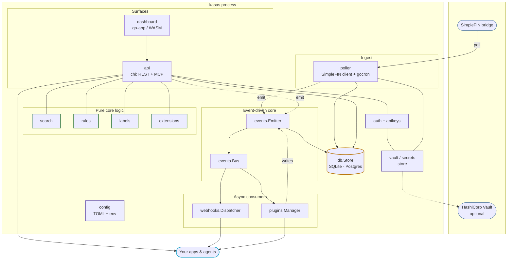
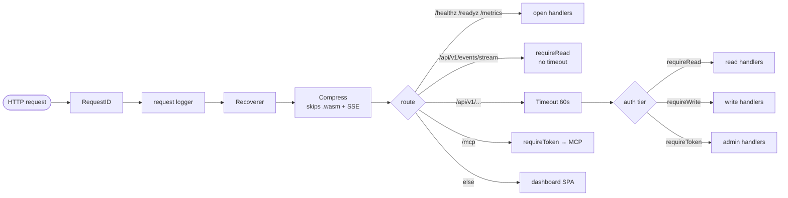
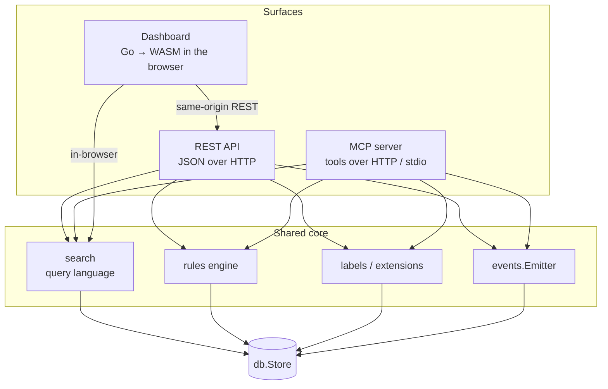

# System Overview

kasas is one Go process. Inside it, a handful of focused packages wire together
into a pipeline: data comes in from SimpleFIN, lands in a database, and is served
out over several surfaces — with a canonical event stream threaded through the
middle so changes can fan out to consumers.

## Components

| Package | Responsibility |
| --- | --- |
| `cmd/kasas` | Entry point and subcommands; wires every component together in `run()`. |
| `internal/config` | Loads configuration from TOML + environment (viper), with defaults and validation. |
| `internal/vault` | Secret store: SimpleFIN access URL + dashboard token, in Vault KV v2 or a local `0600` file. |
| `internal/auth`, `internal/apikeys` | The dashboard-token guard and scoped API keys behind the three [auth tiers](../interfaces/authentication.md). |
| `internal/poller` | The [sync pipeline](../features/sync.md): the SimpleFIN HTTP client plus a `gocron` scheduler. |
| `internal/db` | The `Store` abstraction over [SQLite and Postgres](data-model.md), with sqlc-generated queries. |
| `internal/events` | The [event stream](../features/event-stream.md): the transactional `Emitter` and the in-memory `Bus`. |
| `internal/search`, `rules`, `labels`, `extensions` | Pure, dependency-light logic reused across every surface. |
| `internal/api` | The chi [REST API](../interfaces/rest-api.md) and the [MCP server](../interfaces/mcp.md). |
| `internal/dashboard` | The [go-app dashboard](../interfaces/dashboard.md) (Go → WebAssembly), embedded in the binary. |
| `internal/webhooks` | The [webhook dispatcher](../features/webhooks.md): rides the bus, signs and delivers. |
| `internal/plugins` | The [plugin manager](../features/plugins.md): loads and runs sandboxed plugins off the bus. |
| `internal/selfupdate` | The [self-update](../reference/cli.md#self-update) check + in-place apply. |

## Startup & lifecycle

`run()` constructs everything in dependency order; `serve()` then starts the
background workers and the HTTP server and blocks until a signal arrives. Note
how the **event bus is the gate**: when `events.enabled` is false, the bus and
emitter stay `nil`, and the webhook dispatcher, plugin manager, history, and all
event emission simply never happen.

```mermaid
flowchart TD
    A[config.Load] --> B[slog logger]
    B --> C[openDB<br/>SQLite WAL · Postgres pgx]
    C --> D[runMigrations<br/>embedded goose]
    D --> E[newStore<br/>db.Store]
    E --> F{events.enabled?}
    F -->|yes| G[NewBus + NewEmitter]
    F -->|no| H[bus = emitter = nil]
    G --> I
    H --> I[vault.New<br/>secret store]
    I --> J[auth.New<br/>dashboard-token guard]
    J --> K[poller.New]
    K --> L[dashboard handler<br/>if enabled]
    L --> M[update checker<br/>if update.check]
    M --> N{plugins.enabled<br/>&& bus?}
    N -->|yes| O[plugins.NewManager]
    N -->|no| P[manager = nil]
    O --> Q
    P --> Q[api.New]
    Q --> R{command}
    R -->|serve| S[serve&#40;&#41;]
    R -->|sync| T[one Sync, exit]
    R -->|migrate| U[exit]
    R -->|mcp| V[MCP over stdio]

    S --> S1[trap SIGINT/SIGTERM]
    S1 --> S2[start: update check ·<br/>retention pruners ·<br/>webhook dispatcher ·<br/>plugin manager]
    S2 --> S3[poller.Start<br/>+ run-on-start sync]
    S3 --> S4[http.Server.ListenAndServe]
    S4 --> S5{signal}
    S5 -->|received| S6[bus.Close<br/>unblock SSE]
    S6 --> S7[http Shutdown<br/>15s grace]
    S7 --> S8[poller.Stop]
```

!!! note "Graceful shutdown order"
    On `SIGINT`/`SIGTERM` the [event bus](../features/event-stream.md) is closed
    **first**, so live SSE subscribers unblock and their handlers return — then
    the HTTP server drains within a 15-second grace window instead of waiting it
    out, and finally the poller stops. Events and changes are always written in
    one DB transaction, so an interrupt mid-sync leaves no partial state.

## The request path

Every HTTP request passes through a small chi middleware stack before reaching a
handler:

The probes (`/healthz`, `/readyz`) and `/metrics` are always open for container
orchestration and Prometheus. The live SSE tail is registered **outside** the
60-second request timeout so it can stay open. Everything under `/api/v1` and
`/mcp` is gated by an [auth tier](../interfaces/authentication.md); unmatched
paths fall through to the dashboard single-page app.

## Three surfaces, one core

The most important structural property of kasas: **REST, MCP, and the dashboard
are thin presentations over the same core logic.** Search, rules, labels, and the
event emitter are written once, in pure packages, and every surface calls them.

The [search query language](../features/search.md) is the clearest example: it is
a pure-Go package with no database dependency, so it runs server-side for REST
and MCP **and** compiles to WebAssembly to run directly in the browser for the
dashboard — the exact same grammar and matcher in all three places.

## The event-driven core

Threaded through everything is the [event stream](../features/event-stream.md).
Whenever a sync, an API call, or a plugin changes data, the change and a
corresponding event are written **in the same database transaction**; after that
transaction commits, the event is published to an in-memory bus that fans out to
SSE subscribers, the webhook dispatcher, and the plugin manager.

This is what makes kasas a platform rather than a database with an API: consumers
don't poll for diffs, they **subscribe to facts**. The mechanics — the
emit-then-publish boundary, sequence numbering, and the drop-and-replay catch-up
that webhooks and plugins share — are covered in detail on the
[Event Stream](../features/event-stream.md) page.

## Where to go next

- [Data Model](data-model.md) — the tables, the ER diagram, and the multi-dialect storage layer.
- [Sync Pipeline](../features/sync.md) — how a single sync run actually works, step by step.
- [Event Stream](../features/event-stream.md) — the transactional emit-then-publish core.
