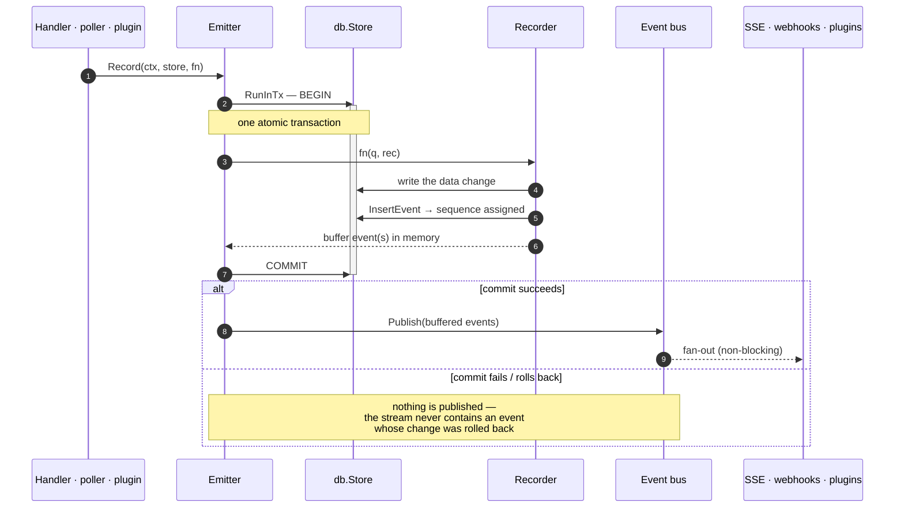
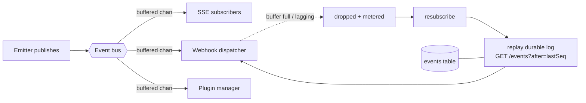

# Event Stream

The event stream is what turns kasas from "a database with an API" into a
platform. It is a **canonical, append-only, ordered, replayable log** of every
meaningful change. Consumers read *what changed and when* instead of re-diffing
current state — the substrate for sync engines, notifications, automations,
external integrations, and CQRS / event-sourcing.

Source: [`internal/events`](https://github.com/paulmeier/kasas/tree/main/internal/events).
Toggle with `events.enabled` (default on).

## The event envelope

Each event is **self-contained**: its `data` carries a full snapshot of the
entity, so a consumer never needs a follow-up query — and even a `*.deleted` event
carries the entity's last-known state.

```json
{
  "sequence":    42,
  "event_id":    "550e8400-e29b-41d4-a716-446655440000",
  "type":        "transaction.created",
  "entity_type": "transaction",
  "entity_id":   "abc-123",
  "occurred_at": "2026-06-06T12:34:56Z",
  "data":        { "id": "abc-123", "account_id": "...", "amount": "-12.34", "...": "..." }
}
```

| Field | Meaning |
| --- | --- |
| `sequence` | Monotonic cursor (the DB autoincrement id). Strictly increasing, **may have gaps**. |
| `event_id` | UUID. The idempotency / dedupe key. |
| `type` | Dotted event type (taxonomy below). |
| `entity_type` / `entity_id` | The subject — `transaction`, `account`, `rule`, `label`, `sync`. |
| `occurred_at` | When the change happened (RFC 3339 UTC). |
| `data` | A snapshot payload; shape depends on `type`. |

## Emit-then-publish: the transactional core

The defining property of the stream: **an event and the change it describes are
written in the same database transaction, and the event is published to live
subscribers only after that transaction commits.** This is the
[`Emitter.Record`](https://github.com/paulmeier/kasas/blob/main/internal/events/emitter.go)
seam, and every mutation in kasas — sync, REST edit, rule, plugin — goes through
it.



Two consequences fall out of this design and define the **consumer contract**:

- **Durability before delivery.** The event exists in the `events` table the
  instant the change is durable. Live publication is a best-effort accelerator on
  top; if a subscriber misses it, the durable log is the source of truth.
- **No phantom events.** Because the event and change share a transaction, a
  rolled-back change publishes nothing. The stream and reality can't disagree.

!!! warning "Sequence numbers can have gaps"
    `sequence` comes from the database autoincrement, so a **rolled-back change
    still consumes a value**. The sequence is strictly increasing but not
    contiguous. Treat it as an opaque **cursor**, not a count — order by it, page
    forward with `?after=`, and **dedupe on `event_id`**.

## Fan-out, lag, and catch-up

After commit, events go to an in-memory `Bus` that fans out to every subscriber
over a buffered channel (depth 64). The bus is **non-blocking**: if a subscriber
falls a full buffer behind, the bus drops it (and meters
`kasas_events_dropped_total`) rather than letting one slow consumer stall
everyone.



This drop-and-replay is **not** an error path — it is the normal way
[webhooks](webhooks.md) and [plugins](plugins.md) stay correct. They track the
last sequence they processed; if the live subscription drops (a burst, a large
sync, a restart), they resubscribe and replay the gap from the durable log via
`ListEventsAfter`. The result is **eventual consistency without a persistent
delivery queue** — the durable event table *is* the queue.

## Event taxonomy

| Type | Emitted when |
| --- | --- |
| `transaction.created` | A new transaction is inserted by a [sync](sync.md) or [entered manually](manual-entry.md). |
| `transaction.updated` | A re-sync changes a source-owned field, or a manual transaction is edited. |
| `transaction.deleted` | A [manual transaction](manual-entry.md) is deleted (or removed as part of deleting its account). |
| `account.created` / `account.updated` | An account first appears / changes. |
| `account.deleted` | A [manual account](manual-entry.md) is deleted (its transactions emit `transaction.deleted` first). |
| `label.applied` / `label.removed` | A transaction's [labels](labels.md) change (granular, per key). |
| `extension.set` / `extension.removed` | A transaction's [extensions](schema-extensions.md) change (granular, per key). |
| `rule.created` / `rule.updated` / `rule.deleted` / `rule.executed` | [Rule](rules.md) lifecycle and runs. |
| `sync.completed` | A [sync run](sync.md) finishes. |

!!! note "Granular vs. coarse"
    Single-transaction label/extension edits emit **granular** per-key events with
    `entity_type: "transaction"`. A bulk label-vocabulary delete (removing a key
    from every transaction) emits **one coarse** `label.removed` with
    `entity_type: "label"`. Management actions — minting an API key, registering a
    webhook — intentionally do **not** emit events.

## Consuming the stream

### Poll a cursor

```sh
# A sync engine's main loop: page forward from your last cursor.
curl "localhost:8080/api/v1/events?after=42&limit=100"   # -> {"events":[…],"next":57}

# Everything for one transaction — its full timeline:
curl "localhost:8080/api/v1/events?entity_type=transaction&entity_id=abc-123"
```

`GET /api/v1/events` supports `?after=`, `?type=`, `?entity_type=`, `?entity_id=`,
`?limit=`, and `?newest` for the most recent events. It returns `{events, next}`,
where `next` is the cursor for the following page.

### Follow live over SSE

```sh
# Replay the backlog from a cursor, then follow live (Bearer auth works for curl):
curl -N -H "Authorization: Bearer $TOKEN" \
  "localhost:8080/api/v1/events/stream?after=42"
```

The Server-Sent Events tail at `/api/v1/events/stream` streams new events as they
commit. Pass `?after=<sequence>` to replay the backlog first and then follow;
omit it to stream only new events. Each SSE frame uses the event's `sequence` as
its `id`, the `type` as the event name, and the full envelope as the JSON `data` —
so a reconnecting client resumes cleanly with `?after`. A subscriber that lags too
far is dropped and should reconnect with its last sequence.

!!! info "Why the dashboard polls instead of streaming"
    A browser `EventSource` cannot send an `Authorization` header, so the
    dashboard's [Events page](../interfaces/dashboard.md) polls `/api/v1/events`
    forward. Non-browser consumers (curl, a Go service) use SSE with a Bearer
    token. Both read the identical stream.

## Retention

The log is append-only and, by default, kept **forever** so it stays fully
replayable from sequence 0 (`events.retention_days = 0`). Set a positive
`events.retention_days` to prune events older than that many days on a 6-hour
schedule — at the cost that a consumer offline longer than the window loses the
pruned history. [Transaction history](transaction-history.md) has its own,
independent retention because it is meant to be kept far longer.

## Built on the stream

Everything reactive in kasas is a consumer of this one stream:

- [**Webhooks**](webhooks.md) — push events to external HTTP endpoints.
- [**Plugins**](plugins.md) — react to events in-process, in a sandbox.
- [**Transaction history**](transaction-history.md) — rides the same emitter seam
  to record snapshots.
- The dashboard [**Events page**](../interfaces/dashboard.md) and the
  [`list_events`](../interfaces/mcp.md) MCP tool.
