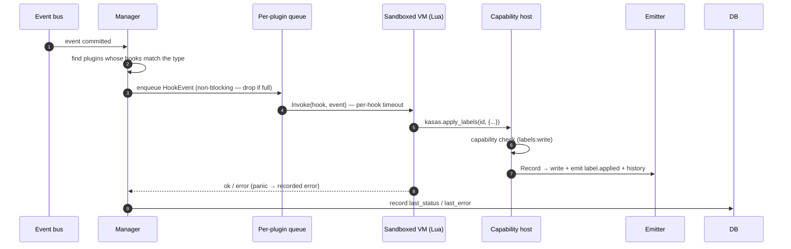

# Plugins

Plugins are the **in-process** counterpart to [webhooks](webhooks.md): instead of
pushing events to an external service, a plugin runs *inside* kasas, in a sandboxed
language VM, and reacts to the same committed events. They let developers extend
kasas — tax, budgeting, forecasting, notifications — without bloating the core
ledger. v1 ships the **Lua** runtime
([gopher-lua](https://github.com/yuin/gopher-lua), pure Go, no cgo);
JavaScript/TypeScript and Go (via WASM) are planned behind the same adapter seam.

Source: [`internal/plugins`](https://github.com/paulmeier/kasas/tree/main/internal/plugins).
Requires `events.enabled` and `plugins.enabled`.

## Safe by construction

Plugins run **asynchronously, after commit** (like webhooks, not like the
synchronous [rules engine](rules.md)): a slow or crashing plugin can never block or
corrupt a sync. Each plugin runs on its own goroutine with a per-hook timeout, a
non-reentrant VM touched by only that one goroutine, and a panic that becomes a
recorded error rather than a crash.

## Installing a plugin

Drop a directory into the plugins folder (`plugins.dir`, default `/data/plugins`):

```text
/data/plugins/
  budgeting/
    plugin.toml      # manifest (required)
    main.lua         # entrypoint (manifest `entrypoint`, default main.lua)
```

The manifest declares the lifecycle **hooks** the plugin implements and the
**capabilities** it needs:

```toml
name        = "budgeting"          # must match the directory name
version     = "0.1.0"
description = "Auto-categorize spending"
runtime     = "lua"
entrypoint  = "main.lua"

# Hooks fire on matching events: OnTransactionCreate (transaction.created),
# OnTransactionUpdate (transaction.updated), OnSyncComplete (sync.completed).
hooks = ["OnTransactionCreate", "OnTransactionUpdate"]

# Capabilities the host grants and enforces: transactions:read,
# labels:write, extensions:write.
capabilities = ["transactions:read", "labels:write"]

[config]                            # arbitrary config, exposed as kasas.config
keyword = "coffee"
```

A plugin implements its declared hooks as global functions and acts through the
capability-checked `kasas` **host API**:

```lua
function OnTransactionCreate(txn)
  if string.find(string.lower(txn.description), kasas.config.keyword, 1, true) then
    kasas.apply_labels(txn.id, { category = "food" })   -- routes through the normal
    kasas.log("info", "tagged", { id = txn.id })        -- emitter: emits label.applied
  end
end

function OnTransactionUpdate(txn) OnTransactionCreate(txn) end
```

## How a hook runs



Because a plugin's writes go through the **same emitter** as a REST or rules edit,
they produce the normal `label.applied` / `extension.set`
[events](event-stream.md) and [history](transaction-history.md) — and flow onward
to webhooks and other consumers. A plugin is a first-class participant in the
event stream, not a side channel.

## The host API

The `kasas` table is the **only** way a plugin touches your data, and every method
that needs a capability checks it up front in a single host facade — so every
runtime (Lua today, JS/WASM later) inherits the same enforcement:

| Function | Capability |
| --- | --- |
| `kasas.get_transaction(id)` | `transactions:read` |
| `kasas.search(query, limit?)` | `transactions:read` |
| `kasas.apply_labels(id, {k=v,…})` | `labels:write` |
| `kasas.remove_labels(id, {k,…})` | `labels:write` |
| `kasas.set_extension(id, key, value)` | `extensions:write` |
| `kasas.remove_extension(id, key)` | `extensions:write` |
| `kasas.log(level, msg, {k=v,…})` | — (always allowed) |
| `kasas.config` | — (the manifest `[config]` table) |

A call to a host function the plugin wasn't granted returns an error.

## The runtime seam

The manager, host facade, and capability model are **language-agnostic**. A
language plugs in by implementing two small interfaces, so adding JS or Go-via-WASM
later touches no core logic:

```go
type Runtime interface {
    Name() string                                          // "lua", later "js" / "wasm"
    Load(ctx, Manifest, dir string, Host) (Instance, error)
}
type Instance interface {
    Invoke(ctx, Hook, HookEvent) error
    Close() error
}
```

The Lua runtime opens a gopher-lua VM with **only safe libraries** (base, table,
string, math), removes every escape hatch (`dofile`, `loadfile`, `load`,
`require`, `module`, `newproxy`), routes `print` to structured logging, injects the
`kasas` table, and resolves the declared hook functions. Each `Invoke` sets the
VM's context so a runaway pure-Lua loop is interrupted at the deadline.

## Enabling is opt-in & admin-only

A plugin is third-party code, so discovery and execution are separated:

- The `plugins.enabled` switch only makes plugins **discoverable**. Discovered
  plugins start **disabled**.
- **Enabling one loads and runs its code**, so that action is **admin-only** (the
  [dashboard token](../interfaces/authentication.md), never an API key).

```sh
curl -s -H "Authorization: Bearer $KASAS_DASHBOARD_TOKEN" http://localhost:8080/api/v1/plugins
# -> {"plugins":[{"id":1,"name":"budgeting","state":"disabled","hooks":[…],…}]}

curl -X POST -H "Authorization: Bearer $KASAS_DASHBOARD_TOKEN" \
  http://localhost:8080/api/v1/plugins/1/enable
# -> {"id":1,"name":"budgeting","enabled":true,"loaded":true,"state":"loaded",…}
```

| Surface | Operations |
| --- | --- |
| REST | `GET /api/v1/plugins`, `GET /api/v1/plugins/{id}`, admin `POST /api/v1/plugins/{id}/{enable,disable,reload}` |
| MCP | `list_plugins`, `get_plugin`, `enable_plugin`, `disable_plugin`, `reload_plugin` |
| Dashboard | The **Plugins** page: status/health, enable/disable toggle, reload |

The `plugins` table stays lean — name, runtime, granted capabilities, config, and
run health — while the code lives on disk under `plugins.dir`.

## Sandbox & limits (v1)

The Lua VM opens only safe libraries — **no filesystem, process, network, or
dynamic code loading** — and each hook is bounded by `plugins.hook_timeout`. It is
**not** a hard memory sandbox (a buggy plugin can still allocate without bound), so
the v1 trust model is *operator-installed, opt-in* plugins. A stronger WASM sandbox
with hard resource caps — and a plugin marketplace — is the planned next step.
