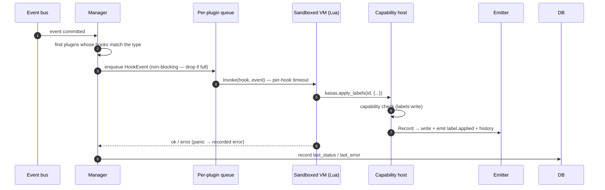

# Plugins

Plugins are the **in-process** counterpart to [webhooks](webhooks.md): instead of
pushing events to an external service, a plugin runs *inside* kasas, in a sandboxed
language VM, and reacts to the same committed events. They let developers extend
kasas — tax, budgeting, forecasting, notifications — without bloating the core
ledger. Three runtimes ship today, all pure Go (no cgo, so the single-static-binary,
multi-arch build is preserved):

- **Lua** ([gopher-lua](https://github.com/yuin/gopher-lua))
- **JavaScript / TypeScript** ([goja](https://github.com/dop251/goja), with
  [esbuild](https://github.com/evanw/esbuild) stripping TypeScript types and
  downleveling modern syntax at load)
- **WASM** ([wazero](https://github.com/tetratelabs/wazero)) — the home for
  plugins written in **Go** (via the [plugin SDK](#go-wasm)), or any other
  language that compiles to `wasip1`

Source: [`internal/plugins`](https://github.com/paulmeier/kasas/tree/main/internal/plugins).
Requires `events.enabled` and `plugins.enabled`.

## Safe by construction

Plugins run **asynchronously, after commit** (like webhooks, not like the
synchronous [rules engine](rules.md)): a slow or crashing plugin can never block or
corrupt a sync. Each plugin runs on its own goroutine with a per-hook timeout, a
non-reentrant VM touched by only that one goroutine, and a panic that becomes a
recorded error rather than a crash.

## Installing a plugin

Drop a directory into the plugins folder (`plugins.dir`, default `/data/plugins`):

```text
/data/plugins/
  budgeting/
    plugin.toml      # manifest (required)
    main.lua         # entrypoint (manifest `entrypoint`, default main.lua)
```

The manifest declares the lifecycle **hooks** the plugin implements and the
**capabilities** it needs:

```toml
name        = "budgeting"          # must match the directory name
version     = "0.1.0"
description = "Auto-categorize spending"
runtime     = "lua"
entrypoint  = "main.lua"

# Event hooks fire on matching events: OnTransactionCreate (transaction.created),
# OnTransactionUpdate (transaction.updated), OnSyncComplete (sync.completed). The
# OnUninstall lifecycle hook (no event) runs once at uninstall so the plugin can
# clean up (see "Uninstalling" below); OnPageRender/OnPageAction back an optional
# dashboard page (see "Dashboard pages" below).
hooks = ["OnTransactionCreate", "OnTransactionUpdate"]

# Capabilities the host grants and enforces: transactions:read,
# labels:write, extensions:write, ui:page.
capabilities = ["transactions:read", "labels:write"]

[config]                            # configurable keys + their DEFAULTS, exposed as kasas.config
keyword = "coffee"
```

A plugin implements its declared hooks as global functions and acts through the
capability-checked `kasas` **host API**:

```lua
function OnTransactionCreate(txn)
  if string.find(string.lower(txn.description), kasas.config.keyword, 1, true) then
    kasas.apply_labels(txn.id, { category = "food" })   -- routes through the normal
    kasas.log("info", "tagged", { id = txn.id })        -- emitter: emits label.applied
  end
end

function OnTransactionUpdate(txn) OnTransactionCreate(txn) end
```

## How a hook runs



Because a plugin's writes go through the **same emitter** as a REST or rules edit,
they produce the normal `label.applied` / `extension.set`
[events](event-stream.md) and [history](transaction-history.md) — and flow onward
to webhooks and other consumers. A plugin is a first-class participant in the
event stream, not a side channel.

## The host API

The `kasas` table is the **only** way a plugin touches your data, and every method
that needs a capability checks it up front in a single host facade — so every
runtime (Lua today, JS/WASM later) inherits the same enforcement:

| Function | Capability |
| --- | --- |
| `kasas.get_transaction(id)` | `transactions:read` |
| `kasas.search(query, limit?)` | `transactions:read` |
| `kasas.apply_labels(id, {k=v,…})` | `labels:write` |
| `kasas.remove_labels(id, {k,…})` | `labels:write` |
| `kasas.set_extension(id, key, value)` | `extensions:write` |
| `kasas.remove_extension(id, key)` | `extensions:write` |
| `kasas.log(level, msg, {k=v,…})` | — (always allowed) |
| `kasas.config` | — (the effective config: manifest defaults + user overrides) |
| `kasas.set_config({k=v,…})` | — (always allowed; a plugin only configures itself) |

A call to a host function the plugin wasn't granted returns an error. The table shows
the **Lua** names; the JavaScript/TypeScript runtime exposes the same methods in
idiomatic **camelCase** (`kasas.getTransaction`, `kasas.applyLabels`, …) — see
[JavaScript & TypeScript](#javascript-typescript) below — and the Go SDK in
exported **PascalCase** (`kasas.GetTransaction`, `kasas.ApplyLabels`, …) — see
[Go (WASM)](#go-wasm).

## Configuring a plugin

The manifest's `[config]` block is the **schema** of what an end user may
configure: it declares every configurable key together with its default. The
user can then override those defaults through **either** of two equivalent
surfaces, and both end up in the same place:

1. **A config TOML file**, edited by hand. Each plugin owns one override file
   that lives *next to* its directory (so a marketplace update — an atomic
   directory swap — never wipes it):

    ```text
    /data/plugins/
      coffee-budget/                 # the plugin's files (replaced on update)
      coffee-budget.config.toml      # the user's overrides (survives updates)
    ```

    ```toml
    # coffee-budget.config.toml — keys must exist in the manifest's [config].
    keyword  = "espresso"
    category = "coffee"
    ```

    The file is read when the plugin loads; after editing it, hit **Reload** on
    the Plugins page (or `POST /api/v1/plugins/{id}/reload`) to apply.

2. **The plugin's own dashboard page**, if the developer builds one. A page can
   include a [`form` block](#dashboard-pages) whose submitted values arrive in
   `OnPageAction`, where the plugin persists them with `kasas.set_config`:

    ```lua
    function OnPageAction(req)
      if req.action == "save_settings" then
        kasas.set_config({ keyword = req.params.keyword })  -- validates, then
      end                                                   -- OVERWRITES the file
      return OnPageRender(req)
    end
    ```

`kasas.set_config` (JS: `kasas.setConfig`) validates every key against the
`[config]` defaults — an unknown key is an error, and each value is coerced to
its default's type (so the string `"25"` from a form lands as a number when the
default is numeric). On success it **overwrites `<name>.config.toml`**, updates
the live `kasas.config` value in place, and returns the new effective config.
The file is therefore always the single source of truth: what the dashboard
saved is exactly what the user sees (and may re-edit) in the TOML.

Precedence, lowest to highest: manifest `[config]` defaults →
`<name>.config.toml` overrides. A broken override file (bad TOML, an unknown
key, a value of the wrong type) fails the plugin's load with a clear error on
the Plugins page rather than silently running on defaults. Uninstalling a
plugin deletes its override file along with its directory.

## JavaScript & TypeScript

Set `runtime = "js"` in the manifest. The entrypoint defaults to `main.js`; for
TypeScript, point it at a `.ts` file — esbuild strips the types (and downlevels
modern syntax) at load, so no build step or `node_modules` is required:

```toml
name        = "budgeting"
runtime     = "js"
entrypoint  = "main.ts"          # or main.js (the default)
hooks        = ["OnTransactionCreate", "OnTransactionUpdate"]
capabilities = ["labels:write", "extensions:write"]

[config]
keyword = "coffee"
```

Hooks are plain **top-level functions** (same names as everywhere else); the host API
is the `kasas` global, in camelCase. Data passed to a hook uses kasas's canonical
snake_case field names (`account_id`, …) — the same shape you would get from the REST
API — and `date` is a JavaScript `Date`.

```typescript
function classify(txn: KasasTransaction): void {
  if (txn.description.toLowerCase().includes(kasas.config.keyword)) {
    kasas.applyLabels(txn.id, { category: "food" });   // routes through the normal
    kasas.setExtension(txn.id, "budgeting.flagged", true); // emitter, like a REST edit
  }
}

function OnTransactionCreate(txn: KasasTransaction) { classify(txn); }
function OnTransactionUpdate(txn: KasasTransaction) { classify(txn); }
```

For editor autocomplete and type-checking, drop this `kasas.d.ts` next to your
plugin. It is **dev-time only** — esbuild discards all types at load:

```typescript
// kasas.d.ts — ambient types for kasas JavaScript/TypeScript plugins.

/** A transaction, in kasas's canonical snake_case shape. */
interface KasasTransaction {
  id: string;
  account_id: string;
  /** Decimal string (never a float) so cents are never lost, e.g. "-4.50". */
  amount: string;
  pending: boolean;
  date: Date;
  description: string;
  payee: string;
  memo: string;
  labels: Record<string, string>;
  extensions: Record<string, unknown>;
}

/** The summary passed to OnSyncComplete. */
interface KasasSyncSummary {
  accounts: number;
  new_transactions: number;
  updated_transactions: number;
  auto_labeled: number;
  duration: string;
}

/** The capability-checked host API. A method throws if the capability isn't granted. */
interface Kasas {
  getTransaction(id: string): KasasTransaction | null;          // transactions:read
  search(query: string, limit?: number): KasasTransaction[];    // transactions:read
  applyLabels(id: string, labels: Record<string, string>): void; // labels:write (merge)
  removeLabels(id: string, keys: string[]): void;                // labels:write
  setExtension(id: string, key: string, value: unknown): void;   // extensions:write
  removeExtension(id: string, key: string): void;                // extensions:write
  log(level: "debug" | "info" | "warn" | "error", message: string,
      fields?: Record<string, unknown>): void;                   // always allowed
  /** Effective config: manifest [config] defaults + the user's overrides. */
  config: Record<string, any>;
  /** Persist config overrides (validated against the [config] defaults),
      overwrite <name>.config.toml, refresh kasas.config, and return it. */
  setConfig(changes: Record<string, unknown>): Record<string, any>; // always allowed
}

declare const kasas: Kasas;
```

Annotate your hook parameters with `KasasTransaction` / `KasasSyncSummary` (don't
re-`declare` the hook functions — you define them). `console.log/info/warn/error/debug`
also work and route to kasas's structured logging.

## Go (WASM) {#go-wasm}

Set `runtime = "wasm"` in the manifest. The entrypoint defaults to `main.wasm` — a
compiled WebAssembly module, executed by [wazero](https://github.com/tetratelabs/wazero)
(pure Go, like the other runtimes). For Go authors there is a first-party **plugin
SDK**; a plugin is an ordinary Go program:

```toml
name        = "budgeting"
runtime     = "wasm"
hooks        = ["OnTransactionCreate", "OnTransactionUpdate"]
capabilities = ["transactions:read", "labels:write", "extensions:write"]

[config]
keyword = "coffee"
```

```go
package main

import (
	"strings"

	kasas "github.com/paulmeier/kasas/pluginsdk/kasas"
)

func init() {
	kasas.OnTransactionCreate(classify)
	kasas.OnTransactionUpdate(classify)
}

func classify(t *kasas.Transaction) error {
	if strings.Contains(strings.ToLower(t.Description), kasas.ConfigString("keyword")) {
		if err := kasas.ApplyLabels(t.ID, map[string]string{"category": "food"}); err != nil {
			return err
		}
		return kasas.SetExtension(t.ID, "budgeting.flagged", true) // routes through the
	}                                                            // normal emitter
	return nil
}

func main() {} // required by the build mode, never runs
```

Build it with the standard Go toolchain (Go 1.24+), no extra tools:

```sh
GOOS=wasip1 GOARCH=wasm go build -buildmode=c-shared -o main.wasm .
```

The module is a **WASI reactor**: kasas runs your `init` functions once at load
(that is where hooks are registered — `main` never runs), then invokes exported
hooks per event. The SDK mirrors the Lua/JS host API one-to-one —
`GetTransaction`, `Search`, `ApplyLabels`, `RemoveLabels`, `SetExtension`,
`RemoveExtension`, `Log`, `Config`/`ConfigString`/`SetConfig` — with the same
capability gates, and ships typed [page builders](#dashboard-pages)
(`kasas.Page`, `kasas.Stat(...)`, `kasas.Form(...)`, …) for dashboard pages.
`fmt.Println` output lands in the plugin log at info level (stderr at error
level).

Failure semantics match the other runtimes, with one twist worth knowing:

- A **handler panic** is recovered by the SDK inside the module and surfaces as a
  recorded hook error — the instance keeps running.
- A **timeout** (`plugins.hook_timeout`) or an `os.Exit` kills the module
  *instance*; kasas transparently **re-instantiates it from the compiled module on
  the next invocation**. In-memory guest state is reset (treat globals as a cache,
  not a store — durable state belongs in labels, extensions, or config).

### Other languages & the ABI

The WASM runtime is not Go-specific — the ABI (v1) is four host functions and a
handshake, all JSON over linear memory, implementable from Rust, Zig, TinyGo, or
anything else that targets `wasip1`:

| Import (`kasas` module) | Meaning |
| --- | --- |
| `input(ptr, cap) -> n` | copy the invocation payload (length arrived as the hook argument) |
| `output(ptr, len)` | set the result envelope: `{"ok":true}`, `{"ok":true,"page":{…}}`, or `{"ok":false,"error":…}` |
| `host_call(ptr, len) -> n` | run a host op `{"op":"apply_labels", …}`; returns response length |
| `read_response(ptr, cap) -> n` | copy (and consume) that response: `{"ok":true,"data":…}` or `{"ok":false,"error":…}` |

The guest exports `_initialize` (the reactor initializer), `kasas_describe()` —
which must `output` `{"ok":true,"abi":1,"hooks":["OnTransactionCreate",…]}` so
kasas can verify at load that every declared hook is really implemented — and one
export per hook, named exactly like the hook, with signature
`(payload_len: u32)`. Host ops mirror the host API: `get_transaction`, `search`,
`apply_labels`, `remove_labels`, `set_extension`, `remove_extension`, `log`,
`get_config`, `set_config`.

## Dashboard pages

A plugin can extend the dashboard with its **own sidebar entry and page**, without
shipping any frontend code. The page is *declarative*: the plugin's `OnPageRender`
hook returns a JSON-shaped **page document** (a list of typed blocks), kasas
validates and normalizes it server-side, and the dashboard renders the blocks with
its own components. Plugin output is always treated as text — a plugin cannot
inject markup, scripts, or styles.

Declare the page in the manifest. The `[ui]` block, the `OnPageRender` hook, and
the `ui:page` capability come as a unit (the manifest is rejected if any of the
three is missing):

```toml
hooks        = ["OnTransactionCreate", "OnPageRender", "OnPageAction"]
capabilities = ["transactions:read", "ui:page"]

[ui]
title = "Coffee Budget"   # sidebar label + default page heading (max 40 chars)
icon  = "chart"           # curated icon name; bell, calendar, chart, coin, flag,
                          # gauge, heart, list, puzzle (default), star
```

The page appears in the sidebar at `/ext/<plugin-name>` while the plugin is
**enabled and loaded** (disable the plugin — or revoke `ui:page` — and the entry
disappears). The hook receives a request (`req.plugin`, `req.action`,
`req.params`) and returns the page:

```lua
function OnPageRender(req)
  local matches = kasas.search(kasas.config.keyword, 100)
  local rows = {}
  for _, t in ipairs(matches) do
    rows[#rows + 1] = { t.description, t.amount }
  end
  return {
    title = "Coffee Budget",
    blocks = {
      { type = "stat", label = "Matches", value = #matches, hint = "tagged so far" },
      { type = "table", columns = { "Description", "Amount" }, rows = rows },
      { type = "actions", actions = { { id = "rescan", label = "Re-scan", style = "primary" } } },
    },
  }
end

function OnPageAction(req)         -- req.action == "rescan", req.params == {…}
  -- do the work (with the plugin's granted capabilities), then re-render:
  return OnPageRender(req)
end
```

**Block types:** `heading` and `text` (a `text` string), `stat` (`label`, `value`,
optional `hint`), `keyvalue` (`items` of `{key, value}`), `table` (`columns` plus
`rows` of cell arrays), `actions` (buttons of `{id, label, style?, params?}` that
POST back to `OnPageAction`), `form` (see below), and `divider`. Scalar values may
be strings, numbers, or booleans — they are normalized to strings. Documents are
bounds-checked (≤256 KiB, ≤200 blocks, ≤1000 table rows, …) and an unknown block
type is an error, so a typo surfaces immediately on the page.

**Form blocks** let a page collect input — the building block of an in-dashboard
settings panel (see [Configuring a plugin](#configuring-a-plugin)). A form is
`{id, fields, submit_label?}`; each field is `{name, label, kind?, value?,
placeholder?, help?, options?}` with `kind` one of `text` (default), `number`,
`toggle`, or `select` (which requires `options`). Submitting POSTs the form's
`id` as the action with every field's current value (a string; toggles send
`"true"`/`"false"`) in `req.params` under the field's name — at most 16 fields,
matching the action-param bound:

```lua
function OnPageRender(req)
  return {
    blocks = {
      { type = "heading", text = "Settings" },
      { type = "form", id = "save_settings", submit_label = "Save",
        fields = {
          { name = "keyword",  label = "Keyword", value = kasas.config.keyword,
            help = "transactions whose description contains this are tagged" },
          { name = "category", label = "Category", value = kasas.config.category },
        } },
    },
  }
end

function OnPageAction(req)
  if req.action == "save_settings" then
    kasas.set_config({ keyword = req.params.keyword, category = req.params.category })
  end
  return OnPageRender(req)
end
```

**Contract & tiers:** treat `OnPageRender` as **read-only** — it runs whenever
someone views the page (`GET /api/v1/plugins/pages/{name}`, read tier). Mutations
belong in `OnPageAction` (`POST /api/v1/plugins/pages/{name}/action`, write
tier), and both hooks run on the plugin's single worker under
`plugins.hook_timeout`, serialized with its event hooks. Render failures are
recorded as plugin health (visible on the Plugins page) and reported on the page
itself.

```bash
# The sidebar entries (read tier).
curl -s localhost:8080/api/v1/plugins/pages
# -> {"pages":[{"name":"coffee-budget","title":"Coffee Budget","icon":"chart"}]}

# Render a page (runs OnPageRender).
curl -s localhost:8080/api/v1/plugins/pages/coffee-budget
# -> {"name":"coffee-budget","page":{"title":"Coffee Budget","blocks":[…]}}

# Press a button (runs OnPageAction; write tier).
curl -s -X POST localhost:8080/api/v1/plugins/pages/coffee-budget/action \
  -H 'Content-Type: application/json' -d '{"id":"rescan"}'
```

## The runtime seam

The manager, host facade, and capability model are **language-agnostic**. A
language plugs in by implementing two small interfaces — that is exactly how JS
and then WASM landed, with no core logic touched:

```go
type Runtime interface {
    Name() string                                          // "lua" / "js" / "wasm"
    Load(ctx, Manifest, dir string, Host) (Instance, error)
}
type Instance interface {
    Invoke(ctx, Hook, HookEvent) error
    Close() error
}
```

The Lua runtime opens a gopher-lua VM with **only safe libraries** (base, table,
string, math), removes every escape hatch (`dofile`, `loadfile`, `load`,
`require`, `module`, `newproxy`), routes `print` to structured logging, injects the
`kasas` table, and resolves the declared hook functions. Each `Invoke` sets the
VM's context so a runaway pure-Lua loop is interrupted at the deadline.

The JS/TS runtime transpiles the entrypoint with esbuild, then runs it in a fresh
goja VM — which exposes no `require`, filesystem, or network by default — injects the
camelCase `kasas` object plus a `console` shim, and resolves the declared hooks as
global functions. A watcher goroutine calls the VM's `Interrupt` at the deadline, so
a runaway `while (true) {}` is stopped just like a Lua loop.

The WASM runtime compiles the module once with wazero and instantiates it as a
WASI reactor with **no preopened directories** (so the entire WASI
filesystem/network surface is dead on arrival), binds the four ABI host
functions, and verifies the `kasas_describe` handshake against the manifest's
hook list. Deadlines interrupt even a tight compiled loop (wazero closes the
module instance); the instance is then re-instantiated from the compiled module
on the next invocation.

## Enabling is opt-in & admin-only

A plugin is third-party code, so discovery and execution are separated:

- The `plugins.enabled` switch only makes plugins **discoverable**. Discovered
  plugins start **disabled**.
- **Enabling one loads and runs its code**, so that action is **admin-only** (the
  [dashboard token](../interfaces/authentication.md), never an API key).

```sh
curl -s -H "Authorization: Bearer $KASAS_DASHBOARD_TOKEN" http://localhost:8080/api/v1/plugins
# -> {"plugins":[{"id":1,"name":"budgeting","state":"disabled","hooks":[…],…}]}

curl -X POST -H "Authorization: Bearer $KASAS_DASHBOARD_TOKEN" \
  http://localhost:8080/api/v1/plugins/1/enable
# -> {"id":1,"name":"budgeting","enabled":true,"loaded":true,"state":"loaded",…}
```

| Surface | Operations |
| --- | --- |
| REST | `GET /api/v1/plugins`, `GET /api/v1/plugins/{id}`, admin `POST /api/v1/plugins/{id}/{enable,disable,reload}`, admin `DELETE /api/v1/plugins/{id}` (uninstall) |
| MCP | `list_plugins`, `get_plugin`, `enable_plugin`, `disable_plugin`, `reload_plugin`, `uninstall_plugin` |
| Dashboard | The **Plugins** page: status/health, enable/disable toggle, reload, uninstall |

The `plugins` table stays lean — name, runtime, granted capabilities, config, and
run health — while the code lives on disk under `plugins.dir`.

## The community marketplace

Installing a plugin by hand means dropping a directory into `plugins.dir`. The
**marketplace** automates discovery and installation from the
[kasas-plugins](https://github.com/paulmeier/kasas-plugins) community registry — a
repository whose submission pipeline gates every plugin (per-language static
analysis, a single self-contained source file, capability review) before it is
listed, so a user can install with confidence.

kasas reads the registry's published, machine-readable **index** (`index.json`),
which lists each plugin with its manifest metadata, capability tier, and a
**per-file SHA-256** plus an aggregate content hash. Installing fetches those files,
**verifies every hash before writing a byte**, and writes the plugin into
`plugins.dir` — so what lands on disk is exactly what was reviewed in the registry,
independent of the transport.

```sh
# Browse the catalog (admin/dashboard token).
curl -s -H "Authorization: Bearer $KASAS_DASHBOARD_TOKEN" \
  http://localhost:8080/api/v1/plugins/registry
# -> {"available":true,"plugins":[{"name":"coffee-budget","capability_tier":"write",
#     "installed":false,"update_available":false,...}]}

# Install (downloads + integrity-verifies, then registers it DISABLED).
curl -X POST -H "Authorization: Bearer $KASAS_DASHBOARD_TOKEN" \
  http://localhost:8080/api/v1/plugins/registry/coffee-budget/install
# -> {"id":2,"name":"coffee-budget","state":"disabled",...}
```

Installing is **admin-only** and never runs code: a freshly installed plugin is
registered **disabled**, exactly like one dropped in by hand — enabling it (which
loads and runs it) stays the separate, deliberate action described above. An install
over an existing plugin (an update) atomically swaps the files and reloads it only if
it was already running.

Configure it under `[plugins.registry]` (effective only when `plugins.enabled` is
true; on by default, pointing at the official registry):

```toml
[plugins.registry]
enabled = true
url     = "https://raw.githubusercontent.com/paulmeier/kasas-plugins/main/registry/index.json"
ref     = "main"   # used to build raw file-download URLs
```

| Surface | Operations |
| --- | --- |
| REST | admin `GET /api/v1/plugins/registry`, `POST /api/v1/plugins/registry/{name}/install` |
| MCP | `browse_plugin_registry`, `install_plugin` |
| Dashboard | The **Marketplace** page: browse, capability-tier warning, one-click install |

## Uninstalling & the cleanup hook

Disabling a plugin only stops it; **uninstalling** removes it entirely. Because a
plugin may have created data (labels, schema extensions), the plugin — not kasas —
owns undoing that. Every plugin therefore implements an **`OnUninstall`** lifecycle
hook, and kasas runs it at uninstall time:

```lua
function OnUninstall()
  -- Undo what this plugin created. It runs with the plugin's granted
  -- capabilities, so it can remove its own labels/extensions via the kasas API.
  kasas.log("info", "budgeting: cleaning up")
end
```

`OnUninstall` is a **lifecycle** hook, not an event hook: it has no triggering
event and is never dispatched off the bus — it is invoked exactly once, when the
plugin is removed. Uninstall:

1. stops the plugin if it is running;
2. loads a fresh, isolated instance (with the plugin's granted capabilities) and
   runs `OnUninstall` under the per-hook timeout;
3. deletes the plugin's files from `plugins.dir` and removes its registration.

The plugin is **always removed**, even if its `OnUninstall` errors or times out —
a buggy cleanup can never trap a plugin as un-removable. The hook's error is
reported back (in the REST/MCP response and the dashboard) so you know cleanup may
have been incomplete. Community plugins are **required** to declare `OnUninstall`
(the [registry](#the-community-marketplace) gate rejects those that don't); a
hand-dropped plugin without it is still removable, just without self-cleanup.

## Sandbox & limits (v1)

All three runtimes run with **no filesystem, process, or network access** and a
single, self-contained file (no `import`/`require`, no `node_modules`) — the Lua VM
opens only safe libraries, the goja VM exposes none of those globals by default
(`eval` and the `Function` constructor binding are removed too), and the WASM
module gets a WASI with no preopens, so every path and socket operation fails by
construction. Each hook is bounded by `plugins.hook_timeout`.

WASM is the strongest of the three: isolation is enforced by the WebAssembly
memory model rather than by withholding APIs, and guest linear memory is **hard
capped at 1 GiB** per plugin. The Lua and JS VMs are not hard memory sandboxes (a
buggy plugin can still allocate without bound), so the v1 trust model remains
*operator-installed, opt-in* plugins — sourced by hand or, with the same
disabled-by-default posture, from the gated
[community marketplace](#the-community-marketplace) above. Pick the WASM runtime
when you want the strongest isolation for third-party code.
