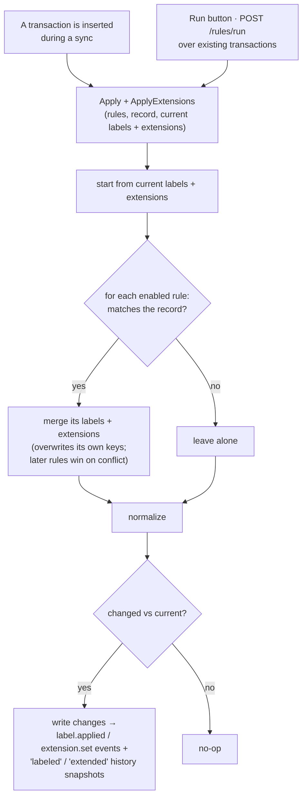

# Rules Engine

Rules automatically tag transactions. A rule pairs a **condition** — a query in
the [search language](search.md) — with an **action**: one or more
[**labels**](labels.md) and/or [**schema extensions**](schema-extensions.md) to
apply to every transaction it matches. Enabled rules run against each newly-synced
transaction automatically, and you can run a rule (or all of them) over your
existing history on demand.

Source: [`internal/rules`](https://github.com/paulmeier/kasas/tree/main/internal/rules)
(matching reuses [`internal/labels`](labels.md) and
[`internal/extensions`](schema-extensions.md) for normalization).

## Anatomy of a rule

```json
{
  "name": "Coffee review",
  "query": "description:coffee amount:>50",
  "labels": { "status": "review" },
  "extensions": { "tax.category": "meal" },
  "enabled": true
}
```

The action must apply **at least one label or extension**. Labels are strict
lowercase `key:value` strings for categorization; extensions are namespaced keys
with arbitrary-JSON values for app-owned metadata (see
[schema extensions](schema-extensions.md)) — a rule can set either or both.

Rules live in the `rules` table — the first piece of state in kasas that is *not*
derived from synced data. Each is compiled by parsing its `query` once
(`rules.Compile` → `search.Parse`); a compiled rule's `Matches(record)` is just
`query.Match`.

## Two triggers, one apply



Labels and extensions are independent merge seams over the same matched rules
(`rules.Apply` for labels, `rules.ApplyExtensions` for extensions); the same
semantics make both safe to re-run:

- **Authoritative for its own keys.** A matching rule overwrites a different
  existing value on a key *it* sets, and leaves all other labels/extensions alone.
- **Last writer wins.** If two rules set the same key, the later one wins
  (rules apply in a deterministic order).
- **Idempotent.** Each merge compares its result to the current set and writes
  nothing if they're identical — so re-running a rule is free and produces no
  spurious events or history.

## At sync time

During a [sync](sync.md), the poller loads all enabled rules, compiles them once,
and applies them to each **newly inserted** transaction — so transactions can
arrive already labeled and extended, folded into their `v1 imported`
[history](transaction-history.md). Rules run on *new* rows only during a sync;
refreshed rows are left untouched, keeping syncs idempotent.

## Running rules

To apply rules to transactions that already exist (you wrote a new rule, or
changed one), run them on demand:

```sh
# create a rule (labels and/or extensions), then apply it to existing transactions
id=$(curl -s localhost:8080/api/v1/rules \
  -d '{"name":"Coffee review","query":"description:coffee amount:>50","labels":{"status":"review"},"extensions":{"tax.category":"meal"}}' \
  | jq .id)

curl -X POST "localhost:8080/api/v1/rules/$id/run"   # -> {"matched":3,"updated":3}
curl -X POST  "localhost:8080/api/v1/rules/run"      # run all enabled rules
```

`run` reports `{matched, updated}` — how many transactions the rule matched, and
how many actually changed (the difference is rows that already had the labels and
extensions). A single-rule run works even if the rule is disabled; the bulk run
applies only enabled rules.

## Undoing a rule

Ran a rule that mass-labeled the wrong transactions? **Unapply** removes what a
rule applied — the inverse of run — from every transaction it currently matches,
so you can clean up before deleting the rule:

```sh
curl -X POST "localhost:8080/api/v1/rules/$id/unapply"  # -> {"matched":42,"removed":42}
```

`unapply` reports `{matched, removed}` — how many transactions the rule matched
and how many it actually removed a label or extension from. Like a single-rule
run, it works even if the rule is disabled (the intended flow is *unapply, then
delete*).

Because kasas stores no record of *which* rule set which label (labels and
extensions are merged flat onto the transaction — the [lean data
model](../adr/index.md)), "the labels this rule applied" is defined as **the keys
the rule declares, on the transactions it matches now**. Two consequences:

- **Only exact matches are removed.** A key is removed only where the current
  value still equals what the rule sets, so a value you edited by hand — or one a
  different rule overwrote — is left alone. Unapply cannot restore a value the
  rule overwrote.
- **It matches the rule's *current* query.** Editing a rule's query and then
  unapplying removes from whatever it matches now, exactly as running it would
  apply to whatever it matches now.

Each removal emits the same granular `label.removed` / `extension.removed`
[events](event-stream.md) and records `labeled` / `extended`
[history](transaction-history.md) snapshots as any other edit, and the operation
emits one `rule.reverted` summary.

## Managing rules

Full CRUD + run parity across every surface:

| Surface | Operations |
| --- | --- |
| REST | `GET/POST/PUT/DELETE /api/v1/rules`, `POST /api/v1/rules/{id}/run`, `POST /api/v1/rules/run`, `POST /api/v1/rules/{id}/unapply` |
| MCP | `list_rules`, `create_rule`, `update_rule`, `delete_rule`, `run_rules` (pass `id` for one, omit for all enabled), `unapply_rule` |
| Dashboard | The **Rules** page: create, edit, enable/disable, delete inline, a **Run** button per rule or for all, and **Remove applied labels & extensions** in a rule's edit form |

Creating or updating a rule **validates the query** — an invalid
[search](search.md) expression is rejected with `400` rather than stored to fail
later — and requires the action to apply at least one label or extension. Rule
lifecycle, runs, and unapplies emit `rule.created` / `rule.updated` /
`rule.deleted` / `rule.executed` / `rule.reverted` [events](event-stream.md), and
applied or removed labels and extensions emit the same `label.applied` /
`label.removed` / `extension.set` / `extension.removed` events as any other
change. New transactions modified by a rule (labeled and/or extended) are metered
as `kasas_rules_applied_total`.
