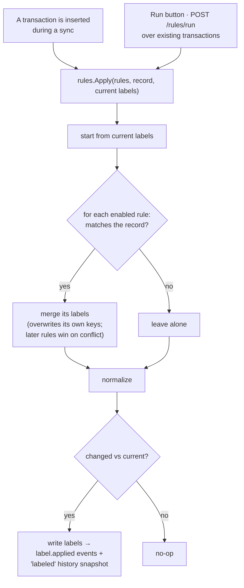

# Rules Engine

Rules automatically label transactions. A rule pairs a **condition** — a query in
the [search language](search.md) — with one or more **labels** to apply to every
transaction it matches. Enabled rules run against each newly-synced transaction
automatically, and you can run a rule (or all of them) over your existing history
on demand.

Source: [`internal/rules`](https://github.com/paulmeier/kasas/tree/main/internal/rules)
(matching reuses [`internal/labels`](labels.md) for normalization).

## Anatomy of a rule

```json
{
  "name": "Coffee review",
  "query": "description:coffee amount:>50",
  "labels": { "status": "review" },
  "enabled": true
}
```

Rules live in the `rules` table — the first piece of state in kasas that is *not*
derived from synced data. Each is compiled by parsing its `query` once
(`rules.Compile` → `search.Parse`); a compiled rule's `Matches(record)` is just
`query.Match`.

## Two triggers, one apply



The semantics that make this safe to re-run:

- **Authoritative for its own keys.** A matching rule overwrites a different
  existing value on a key *it* sets, and leaves all other labels alone.
- **Last writer wins.** If two rules set the same key, the later one wins
  (rules apply in a deterministic order).
- **Idempotent.** `Apply` compares the result to the current labels and writes
  nothing if they're identical — so re-running a rule is free and produces no
  spurious events or history.

## At sync time

During a [sync](sync.md), the poller loads all enabled rules, compiles them once,
and runs `Apply` against each **newly inserted** transaction — so transactions can
arrive already categorized, captured in their `v1 imported`
[history](transaction-history.md). Rules run on *new* rows only during a sync;
refreshed rows are left untouched, keeping syncs idempotent.

## Running rules

To apply rules to transactions that already exist (you wrote a new rule, or
changed one), run them on demand:

```sh
# create a rule, then apply it to existing transactions
id=$(curl -s localhost:8080/api/v1/rules \
  -d '{"name":"Coffee review","query":"description:coffee amount:>50","labels":{"status":"review"}}' \
  | jq .id)

curl -X POST "localhost:8080/api/v1/rules/$id/run"   # -> {"matched":3,"updated":3}
curl -X POST  "localhost:8080/api/v1/rules/run"      # run all enabled rules
```

`run` reports `{matched, updated}` — how many transactions the rule matched, and
how many actually changed (the difference is rows that already had the labels). A
single-rule run works even if the rule is disabled; the bulk run applies only
enabled rules.

## Managing rules

Full CRUD + run parity across every surface:

| Surface | Operations |
| --- | --- |
| REST | `GET/POST/PUT/DELETE /api/v1/rules`, `POST /api/v1/rules/{id}/run`, `POST /api/v1/rules/run` |
| MCP | `list_rules`, `create_rule`, `update_rule`, `delete_rule`, `run_rules` (pass `id` for one, omit for all enabled) |
| Dashboard | The **Rules** page: create, edit, enable/disable, delete inline, and a **Run** button per rule or for all |

Creating or updating a rule **validates the query** — an invalid
[search](search.md) expression is rejected with `400` rather than stored to fail
later. Rule lifecycle and runs emit `rule.created` / `rule.updated` /
`rule.deleted` / `rule.executed` [events](event-stream.md), and applied labels
emit the same `label.applied` events as any other label change. New transactions
auto-labeled by a rule are metered as `kasas_rules_applied_total`.
