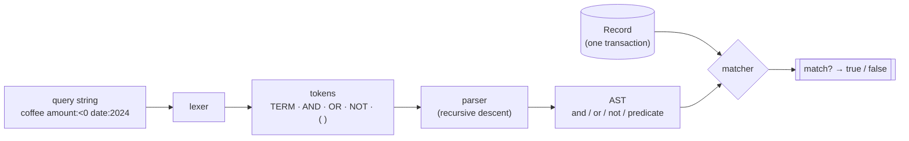
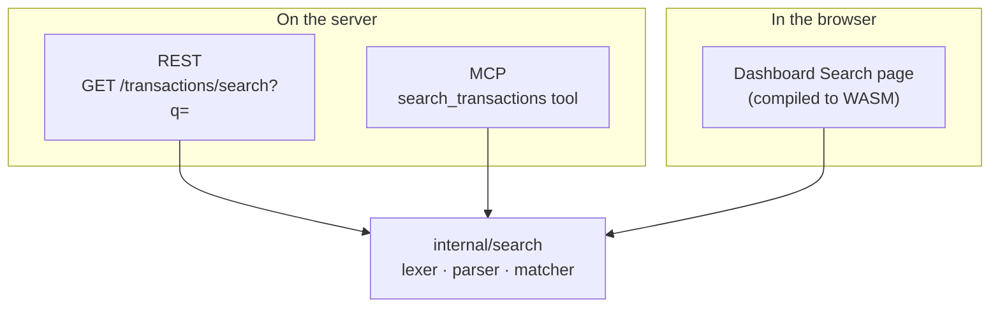

# Search

kasas ships a small, expressive **query language** over your transactions — every
stored field plus any combination of labels and extensions, with boolean logic,
ranges, and grouping. Crucially, it is **one implementation**, a pure-Go package
with no database dependency, reused verbatim across the REST API, the MCP server,
and the in-browser dashboard.

Source: [`internal/search`](https://github.com/paulmeier/kasas/tree/main/internal/search).

## The pipeline

A query string is turned into a matcher in three stages, then run against each
transaction:



- **Lexer** (`lex`) turns the string into tokens — terms, the operators
  `AND`/`OR`/`NOT` (and `& | -`), and parentheses.
- **Parser** (`Parse`) is recursive descent: `parseOr → parseAnd → parseNot →
  parsePrimary`, building an AST of `andNode` / `orNode` / `notNode` / `predNode`
  (a leaf predicate). It returns a `*Query`.
- **Matcher** (`Query.Match`) evaluates the AST against a `Record`. A `nil` root —
  an empty query — matches everything.

The **`Record`** is a neutral view of a transaction: id, account id and name,
amount (parsed *and* raw string), pending, date, synced-at, description, payee,
memo, and the labels and extensions maps. Every surface converts its
transactions into `Record`s and runs the same matcher.

## Grammar

```text
expr     := orExpr
orExpr   := andExpr ( ("OR" | "|") andExpr )*
andExpr  := notExpr ( ("AND" | "&" | <space>) notExpr )*   # adjacency = implicit AND
notExpr  := ("NOT" | "-")* primary
primary  := "(" orExpr ")" | term
term     := word | "quoted phrase" | field ":" value
```

Matching is **case-insensitive**, and an **empty query matches everything**.
Keywords (`AND`/`OR`/`NOT`) are case-insensitive; adjacent terms are implicitly
`AND`-ed.

## Fields & operators

| Form | Meaning |
| --- | --- |
| `coffee` / `"whole foods"` | free text across description, payee, memo, account, id, labels, and extensions |
| `description:` `payee:` `memo:` `account:` `id:` | substring on that field (quote for phrases) |
| `amount:>50` `amount:<0` `amount:10..50` | numeric compare (`> >= < <= = !=`) or range (sign-aware) |
| `date:2024` `date:2024-03` `date:>=2024-01-01` `date:2024-01..2024-06` | year / month / day, compare, or range |
| `pending:true` | the pending flag |
| `label:category=food` / `category:food` | label key = value (the second is shorthand) |
| `label:category` | label key present (any value) |
| `label:store~whole` / `label:category!=food` | label value contains / not-equal |
| `ext:tax.category=meal` | extension key = value (matched as text) |
| `ext:custom.myapp.score` | extension key present |
| `ext:tax.category~me` / `ext:tax.category!=meal` | extension value contains / not-equal |
| `rel:refund_of` | has an outbound [relationship](transaction-relationships.md) of that kind (this transaction is the subject) |
| `rel:transfer_to=txn_123` | an outbound edge of that kind pointing at a specific transaction |
| `related:txn_123` | connected to that transaction in either direction (its neighborhood) |
| `a OR b`, `a b` (implicit AND), `-a` / `NOT a`, `(a OR b) c` | boolean combine, negate, group |

```sh
# coffee outflows in 2024 that aren't reimbursed
curl "localhost:8080/api/v1/transactions/search?q=coffee%20amount:%3C0%20date:2024%20-label:reimbursed"
```

## One language, three surfaces

Because `internal/search` is pure Go (standard library only) it compiles to
WebAssembly and runs **in the browser** for the dashboard — the same grammar and
matcher that serve REST and MCP, with no server round-trip per keystroke.



A consequence worth noting: search is evaluated **in Go, not SQL**, so it can
support arbitrary label/extension combinations and identical semantics everywhere.
The REST and MCP paths fetch the candidate transactions and filter them through
the matcher; the dashboard does the same against the set it already holds. (See
[Dashboard → client-side table](../interfaces/dashboard.md) for why this scales
fine at personal-ledger sizes, and the path to pushing it into SQL if needed.)

!!! tip "Where else the language shows up"
    The same query language is the **condition** in a [rule](rules.md) (`if
    <query> then apply <labels>`). Write and test a query on the Search page, then
    paste it into a rule.

## Using search

| Surface | How |
| --- | --- |
| REST | `GET /api/v1/transactions/search?q=…` → `{query, total, transactions}` |
| MCP | `search_transactions` (same grammar, including `ext:`) |
| Dashboard | The **Search** page, with a syntax-help modal; the last query persists across navigation |
