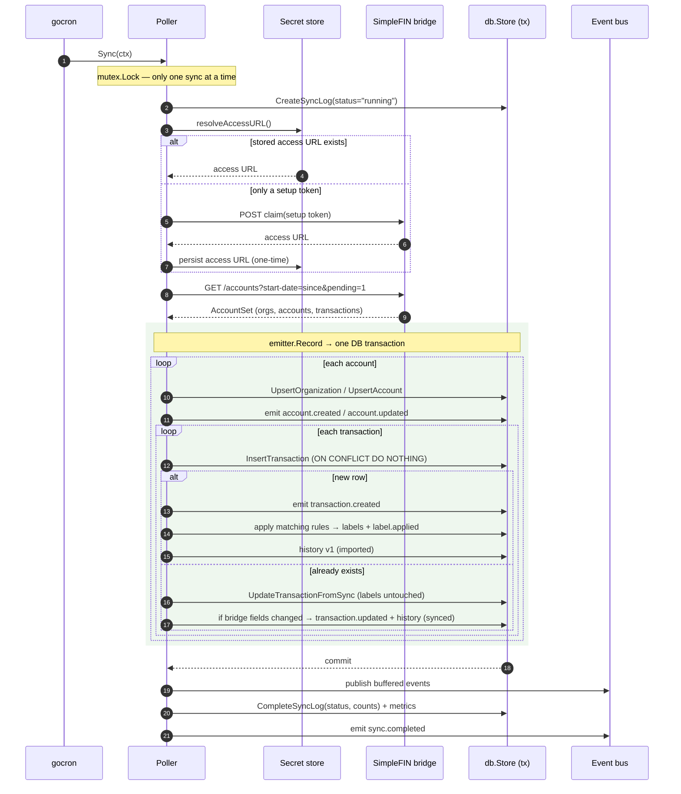
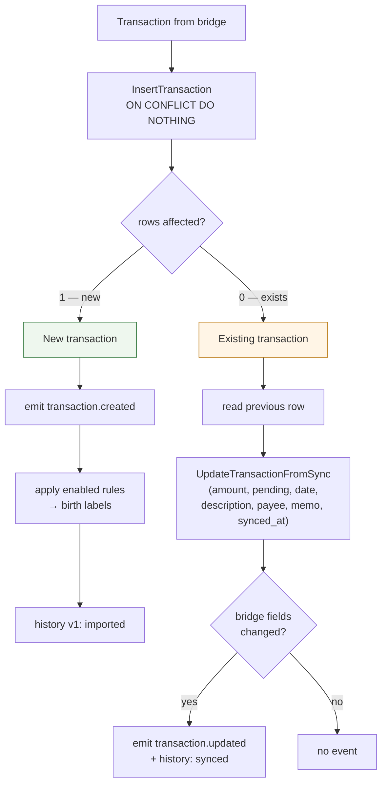

# Sync Pipeline

The sync pipeline is how data gets *into* kasas. A background scheduler polls a
SimpleFIN bridge on an interval, upserts organizations and accounts, and
reconciles transactions — inserting new ones, refreshing existing ones, and
**never touching the metadata you added**. Every run is recorded, and every
change emits an event.

Source: [`internal/poller`](https://github.com/paulmeier/kasas/tree/main/internal/poller).

## At a glance

- **Scheduled** by `gocron` every `sync.interval` (default `6h`), plus an
  optional run at startup and an on-demand trigger.
- **Serialized** — a mutex ensures only one sync runs at a time, so concurrent
  triggers never overlap.
- **Idempotent** — transactions are inserted by their SimpleFIN id with
  `ON CONFLICT DO NOTHING`; re-syncing the same data is a no-op.
- **Non-destructive** — a re-sync refreshes bridge-owned fields (amount, pending,
  description…) but leaves your [labels](labels.md) and
  [extensions](schema-extensions.md) alone.
- **Atomic** — all upserts, inserts, refreshes, label changes, events, and
  history snapshots for a run commit in a single database transaction.

## A sync run, step by step

## Connecting: resolving the access URL

kasas authenticates to SimpleFIN with a long-lived **access URL** (credentials
embedded in the URL's userinfo). `resolveAccessURL` finds it in priority order:

1. **Stored** — a previously persisted access URL in the
   [secret store](../getting-started/configuration.md#secrets) (Vault or the local
   `0600` file). Used as-is.
2. **Configured access URL** — `simplefin.access_url`; persisted to the store on
   first use.
3. **Setup token** — `simplefin.setup_token`, a one-time base64 token. kasas
   base64-decodes it to a claim URL, `POST`s to claim a fresh access URL, and
   **persists that** — so the token is consumed exactly once.

You can also set the credential at runtime from the
[dashboard Settings page](../interfaces/dashboard.md) or
`PUT /api/v1/simplefin/credential`, no restart required — the next sync picks it
up.

## Fetching

`client.Fetch` issues `GET <access-url>/accounts` with two query parameters:

- `start-date=<unix>` — derived from `sync.lookback_days` (default `90`; `0`
  fetches all available history). This bounds how far back each pull reaches.
- `pending=1` — include pending transactions, so a charge is visible before it
  posts.

The response is a SimpleFIN `AccountSet`: organizations, accounts with balances,
and each account's transactions.

## Reconciling: insert vs. refresh

This is the heart of the pipeline, and the guarantee that makes kasas safe to
build on.

For an **existing** transaction, `UpdateTransactionFromSync` writes only the
columns the bank owns. The `labels` and `extensions` columns are **deliberately
excluded from the UPDATE**, so a pending charge that later posts — or an amount
the bank corrects — flows in cleanly while your categorization is preserved
untouched. This is the "the data you add is sacred" principle, enforced at the SQL
level.

## Birth-time labeling

When a transaction is inserted, the poller runs every enabled
[rule](rules.md) against it. Rules are compiled once per sync (their
[search](search.md) queries parsed up front); a matching rule's labels are merged
onto the new transaction, written, and each applied key emits a `label.applied`
event. So a transaction can arrive already categorized, and that categorization is
captured in its `v1 imported` [history snapshot](transaction-history.md).

Rules apply only to **new** transactions during a sync — re-syncing an existing
row never re-runs rules — which keeps syncs idempotent. To apply rules to history,
[run them on demand](rules.md#running-rules).

## The sync log & metrics

Each run writes a `sync_log` row (`started_at`, then `completed_at`, `status` of
`success`/`error`, and any `error` message). The latest status and recent history
are available at `GET /api/v1/sync` and `/api/v1/sync/history`, on the dashboard,
and via the `sync_status` MCP tool. A run also updates Prometheus
[metrics](../interfaces/metrics.md): `kasas_sync_total{status}`, the duration
histogram, `kasas_transactions_inserted_total`, `kasas_rules_applied_total`,
`kasas_last_successful_sync_timestamp_seconds`, and the accounts gauge.

## Triggering a sync

| How | Detail |
| --- | --- |
| Scheduled | Every `sync.interval`; the default `run_on_start=true` also runs one at boot. |
| REST | `POST /api/v1/sync` (runs async, returns `202`). |
| MCP | The `trigger_sync` tool. |
| Dashboard | **Settings → force a sync**, with live status. |
| CLI | [`kasas sync`](../reference/cli.md#sync) runs exactly one sync and exits. |

## Configuration

See [Configuration → `[sync]`](../getting-started/configuration.md#sync) for
`enabled`, `interval`, `lookback_days`, and `run_on_start`.
