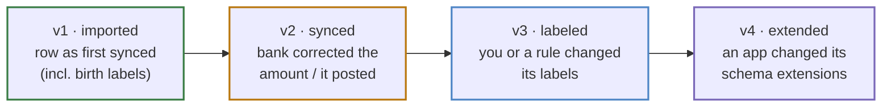
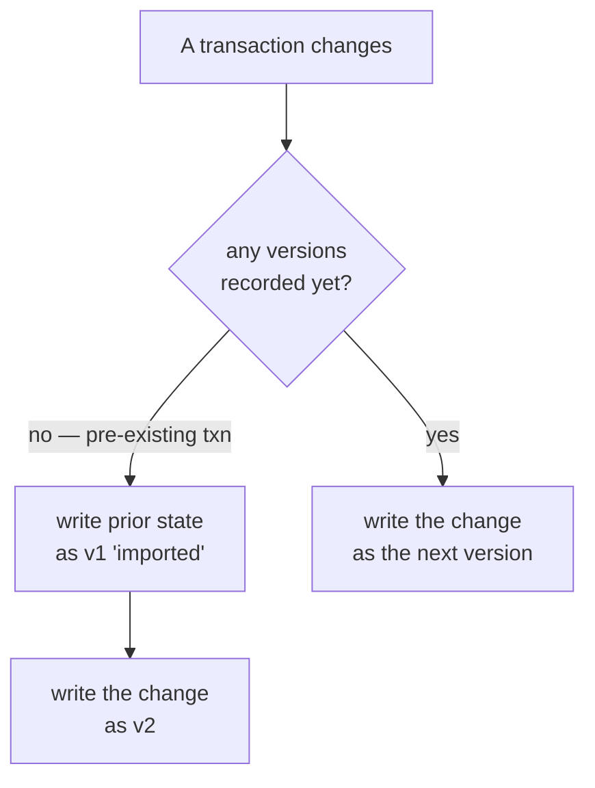

# Transaction History

Every meaningful change to a transaction appends an immutable **full snapshot** to
its history, so you can always answer *"why does this transaction look different
today than it did last month?"* Where the [event stream](event-stream.md) is a
fine-grained, prunable change log, history is the durable, whole-transaction
record.

Source: `transaction_versions` table +
[`internal/events/diff.go`](https://github.com/paulmeier/kasas/blob/main/internal/events/diff.go).

## What a timeline looks like

Reading oldest-first, a transaction's history tells its whole story:



Each version carries the **complete snapshot** at that point plus a computed
**diff** against the previous one — changed scalar fields, and label/extension
adds, removals, and changes.

| `change_kind` | Recorded when |
| --- | --- |
| `imported` | The first version of a transaction (synced in, or a lazily-captured baseline). |
| `synced` | A re-sync changed a source-owned field. |
| `labeled` | [Labels](labels.md) changed (REST, a [rule](rules.md), or a [plugin](plugins.md)). |
| `extended` | [Schema extensions](schema-extensions.md) changed. |

## Diff on read, no version column

Two deliberate design choices:

- **Snapshots, diffed on read.** Each row stores the *whole* transaction state as
  JSON. The diff between consecutive versions is computed when you read the
  history, not stored — `DiffSnapshots` compares the two payloads field by field
  (amounts as decimal strings, never floats) and reports `Fields`, plus
  `LabelsAdded/Removed/Changed` and the extension equivalents.
- **No `version_number` column.** The ordinal (`v1`, `v2`, …) is derived from row
  order on read, not stored. This sidesteps a cross-dialect sqlc inference
  mismatch on `COALESCE(MAX(...))` and a uniqueness race on the un-serialized
  label/sync seams — the autoincrement `id` already gives a stable order.

## Lazy v1 baseline

History recording rides the [emitter](event-stream.md)'s `Recorder.VersionChange`
seam. For a transaction that changes, it ensures there's always a starting point:



This matters for transactions that predate the feature: the **first time** one
changes after upgrading, kasas captures a `v1` baseline from its current state,
then records the change as `v2`. Until a pre-existing transaction next changes,
its history is empty. New transactions get their `v1 imported` snapshot at birth
(including any labels a rule applied), so there's nothing to backfill.

## Recording & retention

Recording rides on `events.enabled`, but **retention is independent**. History is
meant to outlive the noisier event log, so `events.history_retention_days`
defaults to `0` (keep every transaction's full history forever). Set a positive
value to prune snapshots older than N days on the same 6-hour schedule as event
retention; pruning removes the oldest versions first, so a truncated timeline
simply begins at the oldest surviving snapshot.

## Reading history

```sh
# One transaction's full history (oldest first), each with a diff vs the prior version:
curl "localhost:8080/api/v1/transactions/abc-123/history"
# -> {"transaction_id":"abc-123","versions":[{"version":1,"change_kind":"imported",…,"diff":{…}}, …]}
```

| Surface | How |
| --- | --- |
| REST | `GET /api/v1/transactions/{id}/history` |
| MCP | `get_transaction_history` |
| Dashboard | Hover a transaction row and click the **clock** to open its timeline. |

Recording is also metered: `kasas_transaction_versions_total{kind}` counts
snapshots by change kind.
