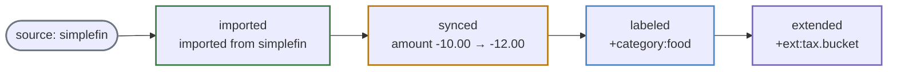

# Transaction Provenance

Every transaction carries a **lineage**: where it came from and how it reached its
current state. Provenance gathers that lineage — scattered across the row, the
account's institution, and the [version history](transaction-history.md) — into one
read-only view, so you can always answer *"where did this transaction come from, and
what has happened to it since?"*

Source: `transactions.source` +
[`internal/provenance`](https://github.com/paulmeier/kasas/tree/main/internal/provenance).

## The provenance object

```json
{
  "transaction_id": "abc-123",
  "source": "simplefin",
  "source_transaction_id": "abc-123",
  "account_id": "acct-checking",
  "institution": "Acme Bank",
  "imported_at": "2024-01-05T08:00:00Z",
  "last_seen": "2024-06-01T08:00:00Z",
  "transformations": [
    { "kind": "imported", "occurred_at": "2024-01-05T08:00:00Z", "summary": "imported from simplefin" },
    { "kind": "synced",   "occurred_at": "2024-02-01T08:00:00Z", "summary": "amount -10.00 → -12.00" },
    { "kind": "labeled",  "occurred_at": "2024-03-01T09:30:00Z", "summary": "+category:food" }
  ]
}
```

## Derived, not stored

Provenance is a **projection**: it stores nothing of its own and emits no events.
Every field is assembled on read from data the ledger already keeps — with one
exception, `source`, which cannot be reconstructed from a transaction's contents and
so is recorded once at ingest.

| Field | Where it comes from |
| --- | --- |
| `source` | **Stored** `transactions.source` — the ingestion path that produced the row. Stamped at insert, **immutable** on re-sync (like labels and extensions). The only field that isn't derived. |
| `source_transaction_id` | `transactions.id` — the source's own transaction id *is* the primary key and dedup key. |
| `account_id` | `transactions.account_id`. |
| `institution` | The account's organization (`account → organizations.name`); best-effort, omitted if unresolved. |
| `last_seen` | `transactions.synced_at` — refreshed on every sync that touches the row. |
| `imported_at` | The earliest [history](transaction-history.md) version's timestamp. For a transaction that predates history and hasn't changed since (no versions), it **falls back to `last_seen`**. |
| `transformations` | The [version](transaction-history.md) timeline, projected to `{kind, occurred_at, summary}`. |

!!! note "Why `source` is the one stored field"
    The other fields are recoverable from the row and its history. *Source* is not —
    nothing in a transaction's source-owned content says which source imported it,
    so whoever ingests has to write it down. It is a per-transaction column, stamped
    at insert (`"simplefin"` today), so a future ingestion path records its own
    source rather than being mislabelled.

## A lineage at a glance

Reading oldest-first, the transformations tell the transaction's whole story:



Each transformation has a `kind` (the same kinds as
[history](transaction-history.md#what-a-timeline-looks-like): `imported`, `synced`,
`labeled`, `extended`), the time it `occurred_at`, and a compact `summary` derived
from the diff against the previous version. The initial import reads
`imported from <source>`; later entries describe what actually changed.

## Relationship to history

Provenance and [history](transaction-history.md) read the **same** version rows but
answer different questions:

- **Provenance** is the *origin summary*: a single object with the source identity,
  first/last seen, and a one-line-per-change lineage. Built for "where did this come
  from?"
- **History** is the *forensic detail*: every full snapshot plus a field-by-field
  diff. Built for "exactly what did it look like at each step?"

So provenance also carries origin facts history does not — `source`,
`source_transaction_id`, `institution`, and the `imported_at` vs `last_seen`
distinction.

## Reading provenance

```sh
curl "localhost:8080/api/v1/transactions/abc-123/provenance"
# -> {"transaction_id":"abc-123","source":"simplefin","imported_at":…,"transformations":[…]}
```

| Surface | How |
| --- | --- |
| REST | `GET /api/v1/transactions/{id}/provenance` |
| MCP | `get_transaction_provenance` |
| Dashboard | Hover a transaction row and click the **branch** icon to open its provenance. |

A read-only view: there is no write path, and a sync never rewrites `source` — the
lineage is immutable, just like the metadata [you add](labels.md). `404` if the
transaction does not exist; a transaction with no recorded history simply returns an
empty `transformations` list with `imported_at` set to `last_seen`.
