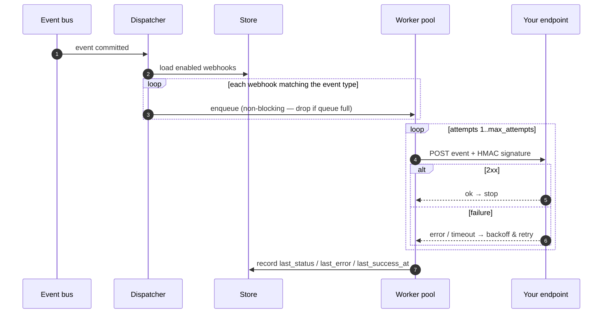
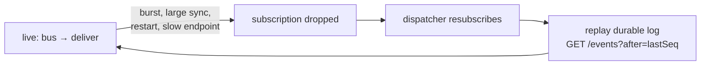

# Webhooks

Webhooks turn the [event stream](event-stream.md) into an **outbound push**: kasas
`POST`s each subscribed event to an HTTP endpoint you register, HMAC-signed, so
external apps react to changes without polling. This is what makes kasas an
**integration hub** — budgeting, accounting, tax, fraud detection, and
notification apps build on the events without kasas implementing any of them.

Source: [`internal/webhooks`](https://github.com/paulmeier/kasas/tree/main/internal/webhooks).
Requires `events.enabled` and `webhooks.enabled` (both default on).

## How delivery works

The dispatcher rides the event [bus](event-stream.md#fan-out-lag-and-catch-up) and
hands matching events to a small worker pool that signs and delivers them, with
retries and persisted health.



Defaults: an 8-worker pool, a 256-deep job queue, a per-attempt timeout of
`webhooks.timeout` (10s), up to `webhooks.max_attempts` (5) tries with exponential
backoff (500 ms, doubling, capped at 30s). If the queue is full the bus reader
**drops** rather than blocks — and the gap is reconciled by replay (below).

## Registering a webhook

Subscribe to specific event types (the same [taxonomy](event-stream.md#event-taxonomy)
as the stream) or to all of them with `*`:

```sh
curl -X POST -H "Authorization: Bearer $KASAS_DASHBOARD_TOKEN" \
  -H 'Content-Type: application/json' \
  -d '{"url":"https://my-app.example.com/hooks/kasas","event_types":["transaction.created","transaction.updated"]}' \
  http://localhost:8080/api/v1/webhooks
# -> {"id":1,"url":…,"event_types":[…],"enabled":true,"secret":"whsec_…"}
```

The signing **secret is returned once, at creation**. An empty `event_types` (or
`["*"]`) subscribes to everything.

## The delivery request

Each delivery is a JSON `POST` of the event — the same envelope as the
[REST/SSE event](event-stream.md#the-event-envelope) — with these headers:

```text
X-Kasas-Event:     transaction.created
X-Kasas-Event-Id:  <uuid>             # idempotency / dedupe key
X-Kasas-Timestamp: <unix seconds>
X-Kasas-Signature: sha256=<hex HMAC>
```

### Verifying the signature

Recompute `HMAC-SHA256(secret, "<timestamp>.<body>")` over the **raw** request
body and compare in constant time. Reject stale timestamps to thwart replay:

```python
expected = "sha256=" + hmac.new(
    secret.encode(), f"{ts}.{raw_body}".encode(), hashlib.sha256
).hexdigest()
assert hmac.compare_digest(expected, request.headers["X-Kasas-Signature"])
```

Always dedupe on `X-Kasas-Event-Id`, since retries and replays can re-deliver an
event.

## Reliability: best-effort + replay

Delivery is **best-effort, not a durable queue**. kasas retries with backoff and
records each endpoint's last-delivery health, but if an endpoint is down long
enough, or kasas restarts, some deliveries are missed.



This is the same drop-and-replay that all event consumers use — and it is the
**normal** path, not just an error path: a large sync can momentarily outrun the
bus buffer, so the dispatcher routinely resubscribes and replays the gap from the
durable [event log](event-stream.md). Your endpoint catches up the same way any
consumer does. That durable log is exactly *why* missed pushes are recoverable —
if you'd rather pull, reconcile yourself via
`GET /api/v1/events?after=<sequence>`.

## Managing webhooks

| Surface | Operations |
| --- | --- |
| REST | `GET/POST/PUT/DELETE /api/v1/webhooks`, `POST /{id}/test`, `POST /{id}/rotate-secret` |
| MCP | `list_webhooks`, `create_webhook`, `update_webhook`, `delete_webhook`, `test_webhook` |
| Dashboard | The **Webhooks** page: register, edit, toggle, send a test delivery, and see per-endpoint health |

Registering and managing webhooks is **admin-only** (the
[dashboard token](../interfaces/authentication.md), never an API key). Delivery is
metered with `kasas_webhook_deliveries_total`,
`kasas_webhook_delivery_attempts_total`, and
`kasas_webhook_deliveries_dropped_total`.

## Webhooks vs. plugins

Webhooks push events to a **separate service over HTTP**. If you'd rather run your
reaction **in-process**, in a sandboxed VM with direct (capability-gated) access
to the ledger, that's what [plugins](plugins.md) are — the same events, consumed
on the inside.
