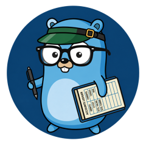
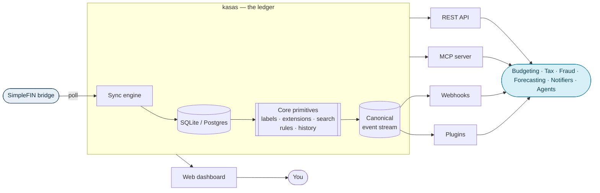

---
hide:
  - navigation
  - toc
---

{ .kasas-logo }

# kasas

A financial ledger that can power all kinds of apps.

[Get started :material-rocket-launch:](getting-started/quick-start.md){ .md-button .md-button--primary }
[Architecture :material-sitemap:](architecture/overview.md){ .md-button }
[REST API :material-api:](interfaces/rest-api.md){ .md-button }

kasas is a **self-hosted, single-binary** Go service that syncs your
[SimpleFIN](https://www.simplefin.org/) financial data into a local **SQLite**
(or **Postgres**) database and turns it into a programmable substrate: a **REST
API**, a built-in **[MCP](https://modelcontextprotocol.io/) server**, a canonical
**event stream**, outbound **webhooks**, and sandboxed **plugins**.

It is deliberately **not** another Mint, budgeting app, or financial planner. It
is the **ledger those apps are built on** — and a lot more. kasas owns the boring,
load-bearing parts (connecting to your bank, deduping and refreshing
transactions, a durable history of every change, an extensible metadata model)
so that anything you or anyone else builds on top — budgeting, tax, fraud
detection, forecasting, notifications, dashboards, AI agents — starts from clean,
queryable, event-driven data.

## What you get

-   :material-sync:{ .lg .middle } __Automatic sync__

    ---

    A background scheduler polls SimpleFIN, inserts new transactions by id, and
    refreshes bridge-owned fields — while **always preserving your labels**.

    [:octicons-arrow-right-24: Sync pipeline](features/sync.md)

-   :material-database:{ .lg .middle } __SQLite or Postgres__

    ---

    Zero-dependency embedded SQLite by default, or point it at Postgres with one
    config change. Same static binary, no CGO.

    [:octicons-arrow-right-24: Data model](architecture/data-model.md)

-   :material-tag-multiple:{ .lg .middle } __Labels & extensions__

    ---

    Strict `key:value` labels for categorization, plus arbitrary namespaced JSON
    **extensions** any app can attach — no schema change required.

    [:octicons-arrow-right-24: Labels](features/labels.md) ·
    [Extensions](features/schema-extensions.md)

-   :material-magnify:{ .lg .middle } __Powerful search__

    ---

    One query language over every field and label/extension combination, with
    `AND`/`OR`/`NOT`, ranges, and grouping — reused across REST, MCP, and the UI.

    [:octicons-arrow-right-24: Search](features/search.md)

-   :material-cog-sync:{ .lg .middle } __Rules engine__

    ---

    `if <query> then apply <labels>` — auto-applied to every new transaction and
    runnable on demand over your history.

    [:octicons-arrow-right-24: Rules](features/rules.md)

-   :material-timeline-clock:{ .lg .middle } __Event stream & history__

    ---

    An append-only, replayable log of everything that changes, plus an immutable
    full-snapshot history per transaction.

    [:octicons-arrow-right-24: Events](features/event-stream.md) ·
    [History](features/transaction-history.md)

-   :material-webhook:{ .lg .middle } __Webhooks & plugins__

    ---

    Push HMAC-signed events to your services, or run sandboxed Lua plugins
    in-process that react to the same events — the integration surface.

    [:octicons-arrow-right-24: Webhooks](features/webhooks.md) ·
    [Plugins](features/plugins.md)

-   :material-robot:{ .lg .middle } __REST + MCP + dashboard__

    ---

    Three surfaces over one core. Drive kasas from code, from an AI agent over
    MCP, or from the built-in WebAssembly dashboard.

    [:octicons-arrow-right-24: REST](interfaces/rest-api.md) ·
    [MCP](interfaces/mcp.md) ·
    [Dashboard](interfaces/dashboard.md)

## Start here

-   :material-rocket-launch:{ .lg .middle } __Quick Start__

    ---

    Run kasas in under a minute with Docker, claim a SimpleFIN token, and see
    your accounts sync.

    [:octicons-arrow-right-24: Get started](getting-started/quick-start.md)

-   :material-sitemap:{ .lg .middle } __Architecture__

    ---

    The platform thesis, the system design, the event-driven core, and the data
    model — with diagrams.

    [:octicons-arrow-right-24: How it works](architecture/overview.md)

-   :material-book-open-variant:{ .lg .middle } __Build on it__

    ---

    The event stream, webhooks, plugins, and MCP are the seams you extend kasas
    through. Start from the philosophy.

    [:octicons-arrow-right-24: Philosophy](architecture/philosophy.md)

