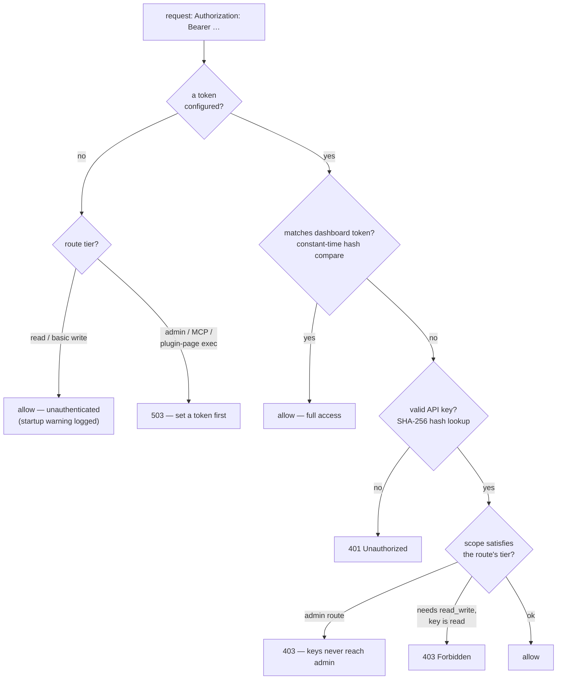

# Authentication & API Keys

By default the REST API and the web dashboard are **unauthenticated for reads** —
convenient on a trusted network, but anyone who can reach the port can read your
financial data. The **dangerous admin operations** (enabling plugins, self-update,
minting API keys, managing webhooks, changing settings, and the MCP-over-HTTP
server) are **always gated**: they require a dashboard token and are refused with
`503` until one is set. And kasas **refuses to start** unauthenticated on a
non-loopback address unless you opt in — see
[Unauthenticated by default](#unauthenticated-by-default). Set a **dashboard token**
to require callers to authenticate for everything, and mint **scoped API keys** for
individual integrations.

Source: [`internal/auth`](https://github.com/paulmeier/kasas/tree/main/internal/auth)
+ [`internal/apikeys`](https://github.com/paulmeier/kasas/tree/main/internal/apikeys).

## Three tiers

Access is gated in three tiers. The dashboard token unlocks everything; API keys
are deliberately capped below admin so a leaked key can never escalate.

| Tier | Accepts | Covers |
| --- | --- | --- |
| **Read** | dashboard token **or any API key** | all `GET` endpoints, the SSE event stream |
| **Write** | dashboard token **or a `read_write` key** | label/extension edits, rule CRUD + run, trigger sync |
| **Admin** | **dashboard token only** | provisioning: API keys, webhooks, plugin enable/reload, SimpleFIN credential, token management, self-update apply |

On an **unsecured** instance (no token set anywhere), the Read and Write tiers stay
open but the **Admin tier is refused with `503`** — the dangerous operations are
never reachable without a token. Plugin **page rendering and actions** run
third-party hook code, so they are gated the same way (the page *list*, which runs
no code, stays open). Set a token to use them.

!!! danger "API keys are never admin"
    The admin tier refuses API keys entirely. A key — even a `read_write` one —
    **cannot** mint another key, manage webhooks, enable a plugin, rotate the
    token, set the SimpleFIN credential, or trigger a self-update. Provisioning
    stays with the operator who holds the dashboard token.

## The decision



Always open, regardless of token: `/healthz`, `/readyz`, `/metrics` (for probes
and Prometheus), and `GET /api/v1/auth` (so the dashboard can learn whether to show
a login screen before it holds a token).

## Unauthenticated by default

With no token set, kasas is open for reads — fine on a trusted network, risky on an
exposed one. Two guards bound the blast radius:

- **The dangerous admin tier always needs a token.** Even unauthenticated, plugin
  enable/install, self-update, API-key/webhook/settings management, restart, and
  MCP-over-HTTP return `503` until you set one. An open instance leaks *reads*,
  never code execution or credential management.
- **kasas refuses to start exposed-and-tokenless.** If `server.addr` binds beyond
  loopback (`:8080`, `0.0.0.0:…`, a LAN or Tailscale IP) and no token is set, kasas
  exits at startup rather than expose your ledger. Set a token, bind to
  `127.0.0.1`, or set `server.allow_unauthenticated = true`
  (`KASAS_SERVER_ALLOW_UNAUTHENTICATED=true`) to run open on purpose.

!!! tip "Docker ships the opt-in"
    The official image and `docker-compose.yml` set
    `KASAS_SERVER_ALLOW_UNAUTHENTICATED=true`, so `docker compose up` works out of
    the box on its published `:8080`. Set `KASAS_DASHBOARD_TOKEN` (or click **secure
    this instance** in the dashboard) to lock it down; you can then drop the opt-in
    so an exposed bind without a token refuses to start.

## The dashboard token

A single shared secret that gates `/api/v1/*` and `/mcp`. Provide it three ways, in
precedence order:

1. **Config / env** — `dashboard.token` or `KASAS_DASHBOARD_TOKEN`. **Authoritative**:
   when set it always applies; rotate by changing the value and restarting.
2. **Generated in the dashboard** — **Settings → Dashboard security → Generate
   token** (or paste your own, ≥16 chars). Stored in the
   [secret store](../getting-started/configuration.md#secrets) next to the SimpleFIN
   credential (local `0600` file, or Vault). Used only when no config/env token is
   set; revocable there too.
3. **None** — kasas logs a warning at startup and the dashboard shows an
   "unsecured" banner.

Clients send it as a bearer token:

```sh
curl -H "Authorization: Bearer $KASAS_DASHBOARD_TOKEN" \
  http://localhost:8080/api/v1/accounts
```

The token is stored only as a SHA-256 hash and compared in constant time. Managing
it from the dashboard is possible only when it is **not** config-managed (a
config/env token is owned by your deployment).

!!! info "MCP and the token"
    The MCP-over-HTTP server at `/mcp` is gated by the **dashboard token**
    specifically (not API keys). The local stdio transport (`kasas mcp`) needs no
    token. See [MCP Server](mcp.md).

## API keys

For external integrations — a budgeting app, a tax tool, a fraud detector, a
notifier — provision a separate **API key** per consumer, so access is scoped and
revocable independently of the admin token.

```sh
# Mint a read-only key. The full secret is returned ONCE — store it now.
curl -X POST -H "Authorization: Bearer $KASAS_DASHBOARD_TOKEN" \
  -H 'Content-Type: application/json' \
  -d '{"name":"Budgeting app","scope":"read"}' \
  http://localhost:8080/api/v1/security/api-keys
# -> {"id":1,"name":"Budgeting app","prefix":"kasas_AbCd1234","scope":"read","key":"kasas_…"}

# Use it exactly like the dashboard token:
curl -H "Authorization: Bearer kasas_…" http://localhost:8080/api/v1/transactions
```

- **Scopes** are `read` (GET only) and `read_write` (also mutations). A
  `read_write` key satisfies both tiers; a `read` key only the read tier.
- **Format** is `kasas_` + 43 chars of base64url entropy.
- **Storage** keeps only a non-secret display `prefix` (the first 16 chars) and a
  **SHA-256 hash** of the full key. The secret is shown exactly once, at creation,
  so a database leak never exposes usable credentials.
- **`last_used_at`** is updated at most once per minute, to avoid write
  amplification on every request.

Mint, list, and revoke under **Settings → API keys**, over REST
(`POST`/`GET`/`DELETE /api/v1/security/api-keys`), or with the MCP tools
`list_api_keys`, `create_api_key`, and `revoke_api_key`.

!!! tip "Defense in depth"
    A token complements, but does not replace, keeping kasas on a trusted network —
    e.g. behind [Tailscale](https://tailscale.com). See
    [Deployment](../getting-started/deployment.md).
