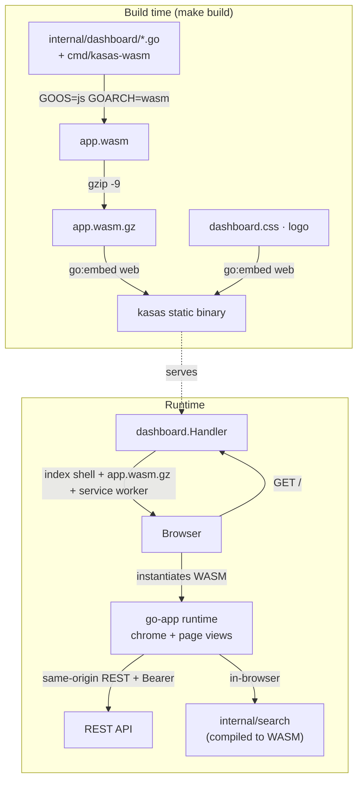

# Dashboard

The dashboard is a lightweight web UI served at `/`. It's a
[go-app](https://go-app.dev) **progressive web app — written in Go, compiled to
WebAssembly, and embedded in the binary** — so there is no Node toolchain, no JS
build, and nothing extra to deploy. It reads from the same-origin
[REST API](rest-api.md).

Source: [`internal/dashboard`](https://github.com/paulmeier/kasas/tree/main/internal/dashboard)
+ [`cmd/kasas-wasm`](https://github.com/paulmeier/kasas/tree/main/cmd/kasas-wasm).
Toggle with `dashboard.enabled` (default on).

## Pages

A collapsible left sidebar (the choice is remembered) navigates eight pages:

| Page | What it does |
| --- | --- |
| **Dashboard** | A balance card per account, and a transactions table — account filter, sortable columns, selectable page size, pagination, inline [label](../features/labels.md) editing, and [manual entry](../features/manual-entry.md): add/edit/delete accounts and transactions. |
| **Search** | The [search language](../features/search.md) over a query box with a syntax-help modal; results table with the same sorting/pagination/label editing. The last query persists across navigation. |
| **Labels** | Every [label](../features/labels.md) with its transaction count, and a delete that strips it from all of them. |
| **Rules** | Create, edit, enable/disable, delete [rules](../features/rules.md) inline, and **Run** one or all. |
| **Events** | A live feed of the [event stream](../features/event-stream.md), polled forward, with an expandable JSON payload per row. |
| **Webhooks** | Register, edit, toggle, and test [webhook](../features/webhooks.md) endpoints; per-endpoint health. |
| **Plugins** | [Plugin](../features/plugins.md) status/health, enable/disable, reload, uninstall (runs the plugin's cleanup hook). |
| **Marketplace** | Browse and install [community plugins](../features/plugins.md#the-community-marketplace) with a capability-tier warning; integrity-verified and installed disabled. |
| **Settings** | Connect a source (SimpleFIN today), manage the [dashboard token](authentication.md), force a sync, and review the effective config (read-only, secrets redacted). |

Synced data is read-only except for **labels** (editable inline);
[extensions](../features/schema-extensions.md) are shown read-only. Accounts and
transactions you create yourself are fully editable — see
[Manual Entry](../features/manual-entry.md).

## How it's built and served

The same `dashboard.Routes()` is registered on **both** the WASM client and the
server handler, so a deep link like `/search` is served the SPA shell instead of
404-ing.

## Component structure

- **`chrome`** — a shared struct embedded by every page. It owns the sidebar, the
  auth gate (prompts for a token on first visit, remembers it in LocalStorage),
  the `apiClient`, and the version badge.
- **Page views** — `dashboardView`, `searchView`, etc. Each embeds `chrome` plus
  mix-ins like `labelEditing` (the inline label editor, shared between the
  Dashboard and Search tables) and `historyViewing` (the
  [history](../features/transaction-history.md) timeline modal).
- **`apiClient`** ([`client.go`](https://github.com/paulmeier/kasas/blob/main/internal/dashboard/client.go))
  wraps an HTTP client whose transport injects `Authorization: Bearer <token>`. It
  mirrors the server DTOs locally so the WASM build doesn't import the server
  package.

Search is the standout: because [`internal/search`](../features/search.md) is pure
Go, the dashboard imports it and runs the **same parser and matcher in the
browser** — instant results with no per-keystroke round-trip.

!!! note "Service-worker versioning"
    go-app's service worker caches the app shell under a key of `app-<Version>`.
    kasas sets that version to the build version plus a hash of the WASM
    *content*, so a stale version string can't pin an old UI — any change to the
    dashboard busts the cache. A corollary when developing: because the service
    worker serves the cached shell offline, a "Failed to fetch" inside a
    rendered dashboard usually means **the server is down**, not a JS bug — check
    the port.

## Disabling it

Set `dashboard.enabled=false` (or `KASAS_DASHBOARD_ENABLED=false`) to stop serving
the UI. The WASM stays embedded in the binary; the route simply isn't mounted, and
`/` falls through.
